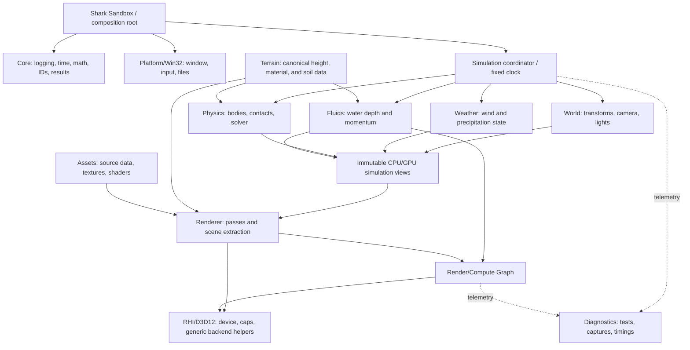

# Shark Engine Plan

- **Status:** Active working plan
- **Plan date:** July 11, 2026
- **Last updated:** July 21, 2026
- **Latest completed:** `PHY-004` - angular rigid-body state
- **Next increment:** `PHY-005` - capsule collision

## 1. Project direction

Shark will be a Windows-first 3D graphics and physics simulation engine built
directly on modern Direct3D 12. It will not become a general-purpose or
RAGE-scale engine. The near-term product is an **Environment Lab**: a small
executable in which we can fly a camera through a sky, explore a large natural
terrain region, begin beside a dry lake basin, add visually convincing water,
collide objects with the terrain, and evolve that water into a physically
meaningful surface-water simulation.

The first vertical slice, **Environment Lab 0.1**, will contain:

- a controllable free-fly camera;
- a basic procedural daylight fallback plus deterministic HDR
  image-based lighting;
- one bounded, resident, mostly flat natural heightfield with physically based
  textures;
- a deterministic dry spawn overlooking a closed lake-like basin;
- a visually convincing static lake surface;
- diagnostics output with frame and GPU timings.

The previously planned visual-rain track (`R-001` through `R-004`) remains
approved but is deliberately deferred. It does not block the terrain, visual
lake, physics, or fluid sequence. Later physical precipitation is driven by
measured `WeatherState` rates and never depends on visual particle count.

The next slice, **Simulation Lab 0.2**, will add:

- a deterministic fixed simulation clock;
- physics use of the canonical terrain height, normal, and ray queries already
  shared with rendering;
- basic rigid bodies colliding with terrain;
- a conservative shallow-water solver; and
- rendering driven by the simulated water state.

The later **Coupled World 0.3** slice will add measured rainfall feeding water,
runoff between terrain tiles, buoyancy, and eventually two-way water/body
coupling. San Andreas-class character, vehicle, world-streaming, population,
mission, audio, and interface systems may come only after this environment
foundation is stable.

### Long-term capability ceiling

Shark's outward feature breadth is deliberately capped at a **San
Andreas-class local open-world sandbox**: the category and approximate scale of
runtime capabilities demonstrated by the original *Grand Theft Auto: San
Andreas* shipped experience, implemented independently with modern technology.
This is a scope boundary, not a promise to reproduce that game feature for
feature.

Within that ceiling, later proposals may cover:

- a region-scale world with streamed outdoor, urban, rural, and limited
  interior cells, plus LOD and culling;
- day/night, weather, terrain, water, particles, props, skinned characters,
  and ordinary environmental effects;
- one authoritative local simulation with controllable third-person
  characters, bounded pedestrians and traffic, and simple interaction/combat;
- arcade-style road, bicycle, rail, water, and air vehicles with enter/exit
  behavior;
- animation, collision, character, rigid-body, and vehicle physics sufficient
  for those systems; and
- bounded mission/event scripting, save/load, map/HUD, input, audio/radio, and
  focused content-authoring tools.

This ceiling limits **feature breadth**, not implementation quality. Shark may
use C++20, Direct3D 12, PBR materials, HDR lighting, higher precision,
deterministic tests, modern accessibility and input practices, current asset
formats, and stronger diagnostics. It does not intentionally reproduce
PlayStation 2 limitations.

The reference is the shipped functional envelope, not a claim that stock
RenderWare supplied every system. Commercial games commonly layered
game-specific technology and content pipelines over middleware. Shark will not
seek RenderWare, Rockstar, or *Grand Theft Auto* source, asset, binary, plug-in,
save, map, or mod compatibility.

The current goalpost is unchanged, although the active order now places a
larger resident terrain and visual lake ahead of physics while visual rain is
deferred. Every milestone through M7, including the bounded shallow-water and
coupling work, remains approved. Those systems may be
more physically honest internally than their historical visual counterparts,
and the M6-M7 fluid depth is an explicitly retained Shark specialization even
where it exceeds the shipped game's simulation depth. It stays bounded to the
already-approved categories of terrain, weather, surface water, and body
interaction; it does not authorize volumetric oceans, planet-scale simulation,
or a broader general-purpose engine.

## 2. Working agreement

Every implementation step is a small, independently understandable increment.
For each increment:

1. We agree on one outcome and its explicit non-goals.
2. Codex implements only that scope and runs the relevant checks.
3. Codex reports the changed files, visible result, checks run, limitations, and
   one suggested commit message.
4. The repository owner reviews `git diff`, stages the desired files, commits,
   and pushes manually.
5. Work on the next increment starts only after the owner confirms the handoff.

Codex will not stage, commit, push, rebase, merge, or alter remotes unless the
owner explicitly asks for that operation. Generated build output, downloaded
dependencies, asset caches, captures, and logs will never be proposed for a
commit.

An increment is complete only when:

- it delivers one observable behavior or one cohesive infrastructure change;
- Debug and Release still build once those configurations exist;
- relevant automated tests pass;
- graphics changes produce no D3D12 debug-layer errors;
- changed decisions are reflected in documentation;
- the diff contains no unrelated refactoring or formatting; and
- the owner has a clear way to reproduce the result.

There is no arbitrary line-count limit. Direct3D 12 setup can be verbose; the
test is whether the change can be reviewed, verified, and reverted on its own.

## 3. Simulation honesty levels

The roadmap labels effects so visual realism is not confused with physical
simulation:

| Label | Meaning | Example |
|---|---|---|
| **V - Visual** | Convincing appearance without a conserved physical state | Rain streak particles or normal-mapped water |
| **S - Simulated** | A real-time mathematical model advances meaningful state | Rigid-body contact or shallow-water depth and momentum |
| **C - Coupled** | Two simulated systems exchange forces or conserved quantities | Rain adds measured water volume or water applies buoyancy |

We will first make an effect visible, then simulate it where that creates useful
behavior, and finally couple systems after each one is independently stable.

## 4. Technical baseline and durable decisions

These choices define the starting line. A later change requires a small
Architecture Decision Record (ADR) explaining why.

| Area | Decision | Reason |
|---|---|---|
| Platform | Windows 11, x64 desktop | Direct3D 12 is the purpose of the project; a cross-platform layer would slow the first vertical slice |
| Language | C++20 with MSVC `14.50` LTS (`v145`) strict conformance | Modern facilities on a three-year LTS compiler family |
| Windowing | Native Win32 | Minimal dependency surface and direct DXGI integration |
| Build | CMake 4.2+, `Visual Studio 18 2026` generator, and vcpkg registry commit `f87344cac03158cbf1467264565f1fd36b382a24` | Reproducible command-line and Visual Studio builds |
| Graphics API | Direct3D 12 behind a narrow Renderer/RHI boundary; typed resource handles remain future work | Keeps native D3D objects private without inventing an unneeded Vulkan abstraction |
| Product scope | San Andreas-class local sandbox feature ceiling, with the current environment/simulation milestones retained | Prevents drift toward a RAGE-scale or general-purpose engine while allowing modern implementation |
| Runtime | Retail DirectX 12 Agility SDK `1.619.4`, pinned in `F-002` | Current stable D3D12 runtime; preview SDKs stay off `main` |
| Shaders | HLSL compiled to DXIL by retail DXC `1.9.2602.24`, pinned in `F-002` | Reproducible Shader Model 6 builds and PIX source debugging |
| Required GPU baseline | Feature Level 12_0+ and Shader Model 6.0+ | Runs the first environment on a broad D3D12 hardware base with conventional descriptor tables |
| Modern GPU profile | Shader Model 6.6+ and Resource Binding Tier 3, capability-gated | Enables direct descriptor-heap indexing when material scale justifies a bindless path |
| Optional GPU techniques | Feature-query and enable individually only for an approved requirement | Feature Level 12_2, DXR, mesh shaders, VRS, and sampler feedback are internal options, never reasons to expand product scope |
| Barriers | Enhanced barriers when supported, legacy encoder fallback | Enhanced barriers are optional at the driver level |
| Rendering | Forward raster first, evolving to clustered Forward+ when needed | Sky, terrain, rain, and water do not justify a deferred renderer initially |
| Simulation | Fixed 60 Hz tick with render interpolation | Stable physics behavior independent of rendering frame rate |
| Physics | Shark-owned interface and initially limited custom solver | Lets us learn and control the simulation; a mature library may later serve as an optional backend or comparison oracle |
| Fluids | 2.5D shallow-water depth/momentum model first | Suitable for puddles, runoff, rivers, and flooding without the scope of full 3D fluid dynamics |
| Threading | Main-thread engine and direct GPU queue first | Correctness and instrumentation precede job systems and async compute |
| Content | Procedural or clearly licensed small test assets | Keeps the repository reproducible and legally clean |

Version pins are updated only in dedicated dependency increments. Preview
Agility SDKs, preview Shader Models, and experimental APIs belong on disposable
experiment branches, not on `main`.

### Initial dependency budget

Keep third-party code deliberately small and pin every dependency:

- retail DirectX 12 Agility SDK and DXC for the runtime and shader toolchain;
- retail `Microsoft.Direct3D.WARP` for a reproducible software-GPU smoke-test
  path;
- DirectX-Headers/`d3dx12.h` and DirectXMath for official API helpers and math;
- DirectXTex/`texconv` for offline texture preparation plus a small DDS runtime
  loader;
- WinPixEventRuntime for GPU event markers;
- `spdlog` for structured development logging; and
- Catch2 for CPU unit and integration tests.

D3D12 Memory Allocator may be added when placed-resource pools begin. Dear ImGui
waits until live simulation tuning needs a debug UI. A third-party physics engine
is not part of the initial solver; it may later be added behind the physics
boundary as a comparison oracle or optional production backend.

### Known development-machine constraints

The development machine is Windows 11 with both an NVIDIA discrete GPU and an
Intel integrated GPU. G-001 now enumerates adapters by high-performance
preference, logs every candidate, supports exact session-index selection, and
provides an explicit packaged-WARP smoke path. WARP is for correctness tests,
not performance validation.

The July 12 prerequisite check reports the `F-002` gate ready with no blocking
failures. Visual Studio 2026, MSVC 14.50 LTS, CMake 4.3.1, vcpkg, Windows SDK,
Graphics Tools, and Ninja are available. PIX remains a non-blocking requirement
only for manually inspecting G-007 captures; the marker runtime is restored by
the project. Global DXC is intentionally unnecessary because Shark restores a
pinned project-local copy. See
[Windows development setup](WINDOWS_SETUP.md).

## 5. World, math, and color conventions

These conventions are fixed before the first camera or shader:

- right-handed world coordinates;
- `+Y` is up, `+X` is right/east, and forward is `-Z`;
- meters, kilograms, seconds, radians, meters/second, and meters/second squared;
- rainfall represented physically as meters of water per second (equivalent to
  volume per area per second);
- Direct3D normalized depth range `[0, 1]` with reversed-Z;
- row-major CPU/HLSL matrices, row vectors, and `mul(vector, matrix)`; DXC uses
  the matching row-major flag;
- linear HDR scene lighting, with sRGB decoding for color textures and tone
  mapping only at final output;
- seeded random streams for repeatable simulation scenarios; and
- `float` local coordinates initially, with origin rebasing deferred until world
  scale demonstrates the need.

GPU particle and fluid results are tolerance-tested; bitwise cross-vendor
determinism is not promised.

## 6. Architecture

Shark begins as a **layered monolith**: clear module boundaries in one engine
library, not a collection of DLLs or tiny libraries. Targets are split only when
independent build or reuse value appears.

The diagram shows orchestration and one-way data flow. The simulation
coordinator calls stateful systems and publishes a snapshot; `World` and
`Physics` never depend on each other in a compile-time cycle.



### Module responsibilities

| Module | Owns | Must not own |
|---|---|---|
| `Core` | logging, assertions, results, time, IDs, math conventions, seeded RNG | window, D3D12, scene policy |
| `Platform/Windows` | Win32 window, messages, input, timing, file watching | renderer or simulation state |
| `RHI/D3D12` | device/capability/debug boundary plus generic frame-resource, device-access, and legacy-transition helpers | terrain, weather, physics, or scene-pass/timing policy |
| `RenderGraph` | pass/resource declarations, order, barriers, lifetimes, queue synchronization | scene mutation or gameplay decisions |
| `Renderer` | public renderer config/frame/status/stats, production frame pipeline, camera data, sky/terrain/water/rain passes, debug views, and private D3D12 presentation backend | authoritative physics or fluid state |
| `Assets` | CPU asset records, loading, derived-data keys, shader artifacts | frame scheduling |
| `World` | transforms, cameras, lights, scenario state, immutable frame snapshots | raw GPU resources |
| `Simulation` | fixed clock, subsystem order, input/output exchange, snapshot publication | rendering passes or subsystem internals |
| `Terrain` | authoritative height/material/soil tiles and spatial queries | D3D12 resource ownership |
| `Weather` | wind, precipitation rate, later temperature/humidity/evaporation drivers | terrain infiltration capacity or rain particles as physical rainfall |
| `Physics` | bodies, colliders, broad/narrow phase, contact solver, debug primitives | D3D headers or render meshes |
| `Fluids` | water depth/momentum, solver, conservation accounting, coupling | presentation or material decisions |
| `Diagnostics` | tests, scenario capture, debug HUD, timings, validation output | production simulation policy |

REN-001 completes the first durable renderer boundary. The public move-only
`shark::renderer::Renderer` owns `RendererConfig`, `RenderFrameData`,
`RenderStatus`, and `RendererStats`; the sandbox passes the existing
`shark::rhi::d3d12::Device` only at the composition root. There is no public
D3D12 `Presentation` class. Presentation and swap-chain operations continue in
the private `engine/renderer/src/d3d12` backend.

The renderer-owned production `frame_pipeline` composes 15 imports and the
`Terrain -> TexturedCube -> Skybox -> Water -> ToneMap` passes. Cube,
daylight, skybox, terrain, water, and tone-map scene helpers also live under
the private renderer D3D12 backend.

The renderer D3D12 backend owns the fixed scene-named timestamp query layout
and accumulator. The D3D12 RHI retains device access, generic frame-resource
state, and legacy transition recording without owning scene policy.

The platform-independent `HeightTileSurface` still owns a validated canonical
tile and cached bounds; height, exact triangle-normal, bounds, and ray queries
never read the smooth render mesh or a D3D12 resource. Only derived render data
and the query-derived diagnostic pin cross into `Renderer`. T-003's separate
platform-independent `MaterialPalette` produces two bounded visual layers and
three full-mip arrays. Material weights and sampled normals remain derived
presentation data and never alter canonical terrain queries.
T-004 adds a derived row-major `4x4` render layout over that same LOD0 surface:
16 `8x8`-cell chunks reference the unchanged 1,089-vertex stream through
contiguous 384-index ranges and carry exact sample-derived AABBs. The renderer
frustum-culls those AABBs without changing canonical query ownership.
T-005 adds one boundary-preserving 240-index coarse range per complete chunk
over the same vertices. Every chunk edge retains all canonical boundary
segments, so equal and mixed LOD choices match without skirts or stitch
variants. Exact continuous vertical deviation is bounded at `0.140625` meters
for the fixture, and a stateless relative-error proxy selects coarse only when
`error <= 0.008 * camera_distance_to_closed_AABB`.

T-006 scales this design without introducing streaming. It adds a separate
bounded resident capacity fixture with `241x241` samples at four-meter spacing:
a `960x960`-meter region containing 58,081 shared vertices and 225
`16x16`-cell render chunks. Its 345,600 LOD0 indices and 194,400 coarse indices
stay inside the global `R16_UINT` vertex-index domain. The surface payload is
2,473,944 bytes (2.359 MiB); the complete packed terrain resources are
2,537,652 logical bytes and require 2,621,440 bytes of committed D3D12
allocation. The current `33x33` fixture remains the permanent compact analytic
regression oracle. T-007 replaces only the capacity fixture's deliberately
simple heights with five fixed-point value-noise bands. The resulting
project-owned landscape has 25.82421875 meters of relief, all 115,200 LOD0
triangles at or below 12 degrees, an 11.251308698-degree maximum slope, and a
0.1171875-meter maximum coarse error without changing topology or resource
budgets. Its four-phase presentation smoke preserves the interactive overview
while finishing from a smoke-only near pose with one LOD0 and 60 coarse chunks,
so both packed D3D12 index ranges stay live. T-008 composes that untouched
rolling-height oracle with a deterministic Q8 basin post-process and publishes
scenario-owned spawn, footprint, core, and future-waterline metadata. The
composite checksum is `0x4890DE3E1AA063A9`; topology and resource sizes remain
unchanged. W-001 consumes that metadata for a presentation-only surface
without changing canonical terrain.

### Non-negotiable ownership rules

1. Full-resolution `HeightTileSurface` data is the single source of truth for
   future collision and the fluid bed. LOD0 rendering and queries use the same
   `v00 -> v11` cell split and planar interpolation exactly. T-005's one
   coarser visual LOD is a derived approximation with an exact measured error
   bound and never changes physics with camera distance.
2. Physics never reads a render mesh or Direct3D resource.
3. Visual rain particles and physical rainfall share `WeatherState`, but particle
   count never determines water volume.
4. The fluid solver owns water state. Rendering receives a read-only snapshot or
   SRV and never mutates the simulation.
5. Render and compute passes declare GPU access to the graph. Individual systems
   do not issue ad hoc barriers or cross-queue waits.
6. Simulation publishes immutable previous/current snapshots. Rendering
   interpolates between them and never advances simulation.
7. No synchronous full GPU readback is allowed in the normal frame loop.

### Frame and simulation flow

```text
Poll input and platform events
  -> accumulate real elapsed time
  -> run zero or more fixed 60 Hz CPU ticks
       1. update weather
       2. consume the newest completed compact fluid-query result, never wait
       3. advance physics and world state
       4. queue versioned weather/body inputs and requested fluid steps
       5. publish the immutable CPU simulation snapshot
  -> interpolate render snapshot
  -> build render/compute graph
       1. advance queued GPU fluid steps with CFL-limited substeps
       2. publish ping-pong fluid render views and enqueue compact query readback
       3. shadows/depth -> terrain/opaque -> sky -> water -> rain -> post/debug
  -> record, submit, present
```

Before the GPU solver exists, the CPU reference can advance inline during a
fixed tick. The normal GPU path is deliberately asynchronous: catch-up ticks
reuse the latest completed compact query and never stall for water. A synchronized
mode exists only for focused verification. This staggered order avoids an
unstable circular solve; iterative two-way coupling is a later milestone.

## 7. Direct3D 12 renderer design

### Device and frame foundation

- Enumerate DXGI adapters using high-performance preference and expose
  `--adapter`, `--warp`, and a capability-report mode.
- Build a `RendererCaps` record using `CheckFeatureSupport`; never infer optional
  support from a feature-level number.
- Before device creation, enable the D3D12 debug layer, optional GPU-based
  validation, and DRED. Configure bounded `ID3D12InfoQueue` and
  `IDXGIInfoQueue` storage plus debugger-break policy without suppressing
  messages. GPU-based validation is an opt-in focused-test mode because it is
  expensive.
- Submission, fence, resize, and present failures query the device-removal
  reason and emit bounded DRED breadcrumb and page-fault details.
- Use a flip-model, triple-buffered swap chain and a reversed-Z depth target.
- Define direct, compute, and copy queue interfaces with monotonic fence
  timelines, but initially submit graphics, compute, and uploads on the direct
  queue. Activate copy or async-compute queues only after the graph owns their
  cross-queue fence handoffs and PIX demonstrates a benefit.
- Use a `FrameContext` per back buffer for command allocators, transient uploads,
  descriptors, timestamps, and a completion set containing every queue fence
  that guards reuse. G-003 establishes one allocator, bounded upload/CPU
  descriptor staging, and one direct-fence checkpoint per context while sharing
  one graphics command list. W-001 uses one fixed 12-query timestamp/readback
  slice per context, backed by one 36-query heap and one 288-byte buffer, and
  reuses each slice only after the same direct-fence checkpoint completes.
  Multi-queue completion sets remain later.
- Defer destruction of GPU resources, descriptors, pipelines, and upload storage
  until every relevant queue fence in their retirement set completes. G-003
  verifies whole-context transient reuse. G-005 creates one persistent root
  signature/PSO, cube vertex/index buffers, checker texture/SRV, and resize-owned
  depth target. S-002 adds a second immutable far-depth sky PSO; S-002A changes
  its visible content from the diagnostic cubemap to procedural daylight.
  T-001 adds terrain vertex/index buffers plus
  solid, wireframe, and bounds PSOs in the same bounded static-upload and
  startup lifetime. T-003 adds three material arrays and a dedicated terrain
  root signature while splitting the procedural sky onto its own b0-only root
  signature. S-003 adds four derived HDR environment textures, a resize-owned
  `R16G16B16A16_FLOAT` scene target, a material-sphere proof pipeline, and a
  final tone-map pipeline; shutdown releases every persistent object after the
  final drain.
  Generic fence-keyed deferred destruction remains later.

### Resources and descriptors

- Expose typed generational handles such as `BufferHandle`, `TextureHandle`,
  `SamplerHandle`, and `PipelineHandle`; raw COM pointers stay below the public
  renderer boundary in the D3D12 RHI or private renderer D3D12 backend.
- Start with committed resources and simple correctness. Add placed-resource
  pools and aliasing only after telemetry shows value.
- Keep persistent resources separate from graph-transient resources.
- Use one shader-visible CBV/SRV/UAV heap and one sampler heap with stable
  persistent indices; recycle slots only after their fences complete. Begin
  with conventional descriptor tables while keeping handles bindless-ready.
  G-005 proves the checker at shader-visible SRV slot 0 and one static sampler.
  S-001 retains the uploaded orientation cubemap at slot 1 as an asset-path
  proof. S-002A makes `Skybox` b0-only and removes that dormant texture from
  the per-frame graph. T-003 fixes albedo, normal, and roughness array SRVs at
  slots 2-4. S-003 fixes diffuse irradiance, prefiltered specular, split-sum
  BRDF LUT, radiance, and resize-owned HDR scene-color SRVs at slots 5-9.
  Terrain binds one contiguous six-entry material/IBL table, while sky, water,
  and tone mapping bind focused one-entry tables; the stable-index allocator
  remains future work.
- Keep CPU-only RTV and DSV allocators separate.
- Add upload and readback arenas, with a per-frame linear upload ring.
- Expose descriptor use and DXGI video-memory budget in diagnostics before
  texture streaming is attempted.

### Shaders and pipelines

- Compile HLSL at build time with pinned DXC and treat warnings as errors. G-004
  resolves only the vcpkg-restored retail DXC `1.9.2602.24`, compiles explicit
  `vs_6_0`/`ps_6_0` entry points with HLSL 2021, strict and row-major flags,
  emits per-configuration DXIL/C++ headers/PDBs, and tracks shared includes
  through depfiles.
- Retain shader PDB/debug data in developer builds for PIX. G-004 embeds source
  debug information while keeping Debug unoptimized and Release optimized.
- Begin with a small shared root-signature convention using descriptor tables and
  frame/pass constants. Direct heap indexing becomes a separate capability-gated
  increment only after Shader Model 6.6, Binding Tier 3, and a real scale need are
  confirmed. S-002A's frame CBV contains the row-major scene and
  translation-free sky matrices plus six packed daylight rows and is visible
  to vertex and pixel stages. The checker cube separately retains one
  single-SRV descriptor table and static sampler. T-003's terrain root adds
  material/view constants and one material table. S-003 extends that table to
  `t0..t5` for the three material arrays plus irradiance, prefiltered
  specular, and BRDF LUT; it also gives sky a radiance-cube table and adds a
  focused tone-map signature for the HDR scene SRV. This is not yet a
  versioned renderer-wide layout.
- Key shader artifacts by source/include hashes, entry point, target, defines,
  flags, compiler version, and root-signature version.
- Cache immutable PSOs by structural hash; never compile a surprise PSO in the
  middle of a render pass. G-005 creates one immutable cube/depth PSO
  synchronously during renderer startup; generalized artifact keys and PSO
  caching remain later. S-002 creates a second immutable skybox PSO from pinned
  build-time DXIL and never compiles pipeline state inside the frame loop.
  S-003 adds immutable material-sphere and tone-map PSOs without moving PSO
  compilation into the frame loop.
- Add development hot reload only after the offline build pipeline is reliable.

### Render graph growth

The graph is renderer infrastructure, not a scene API. G-006 establishes
whole-resource reads and writes, intended resource states, explicit and
hazard-derived dependencies, and an execution callback that can resolve only
its declared resources. Subresource ranges, attachment policy, and queue
preference remain later extensions.

It grows in three deliberate stages:

1. **Simple:** direct queue, imported committed resources, declaration
   validation, stable hazard-aware topological compilation, cycle rejection,
   and centralized legacy barrier encoding. W-001 keeps this first form and
   executes ordered `Terrain`, `TexturedCube`, `Skybox`, `Water`, and
   `ToneMap` passes with explicit HDR scene, environment, texture, and
   input-assembler reads.
2. **Managed:** lifetime analysis, graph-owned transient placed resources,
   resource pooling, subresource scopes, and aliasing.
3. **Optimized:** pass merging, parallel recording, and compute/copy scheduling
   only where PIX proves a benefit.

G-006 provides only a whole-resource legacy-barrier executor. A future
capability-gated increment may add an enhanced-barrier encoder; one model will
then be selected globally for the device lifetime rather than mixed casually
across resources or frames.

### Diagnostics from the first executable

- check every `HRESULT` and name every significant D3D12 object;
- add PIX markers around every pass and major upload; T-001 names the current
  `StaticSceneUpload`, `Frame`, `Terrain`, `TexturedCube`, and `Skybox`
  boundaries, S-003 adds `ToneMap`, and W-001 adds transparent `Water` after
  `Skybox`;
- expose per-pass CPU/GPU timestamps, draws, dispatches, descriptors, memory,
  and queue waits; S-003 reports direct-queue GPU intervals for the frame plus
  separate `Terrain`, `TexturedCube`, `Skybox`, and `ToneMap` intervals; W-001
  adds `Water`, while CPU timings and broader counters remain later;
- keep a WARP smoke path for device creation and a deterministic basic frame;
- treat zero debug-layer errors as an acceptance gate; and
- test real graphics on both the discrete and integrated adapters when their
  capabilities meet the declared baseline.

## 8. Environment and simulation design

### Sky

1. Load a small DDS cubemap and render it without camera translation (**V**).
2. Complete a bounded deterministic HDR path: generate one `64x32` linear
   latitude-longitude daylight source, convert it to a `32x32` six-mip
   radiance cube, derive an `8x8` diffuse-irradiance cube, a `32x32` six-mip
   GGX-prefiltered specular cube, and a `32x32` split-sum BRDF LUT, then light
   terrain and one material sphere from the same data (**V**, `S-003`).
3. Improve the bounded analytic sky and fog only when an approved scene needs
   it (**V**). Volumetric cloud and atmosphere simulation stay outside the
   default scope.

### Terrain and textures

1. Render one procedural or loaded height tile with solid/wireframe debug views.
2. Add exact CPU height, normal, bounds, and ray queries from the same data.
   T-002 completes this with an owning, validated `HeightTileSurface`, inclusive
   maximum footprint edges, float-rounded render-coordinate bracketing,
   deterministic triangle ties, metric rays with scale-relative triangle
   tolerances, and a visible query-derived normal pin.
3. Add PBR texture arrays and slope/height or painted blend weights.
4. Add chunks and frustum culling at full resolution. T-004 completes this
   with 16 exact-AABB chunks and conservative Direct3D frustum tests.
5. Add derived visual LODs with crack-free seams and measured error bounds.
   T-005 completes the bounded first step with one coarse level, identical
   equal/mixed boundary segments, exact continuous vertical-error measurement,
   and stateless distance selection.
6. Prove larger resident capacity without changing canonical ownership or
   index architecture. T-006 completes this with one separate
   `241x241`-sample, four-meter-spacing capacity region, the retained compact
   fixture for tests, a 1,500-meter far plane, scaled navigation, measured
   geometry/startup budgets, and `F4` chunk/query diagnostics that are off by
   default.
7. Shape that region with deterministic project-owned, multi-scale rolling
   terrain. T-007 completes this with five fixed-point value-noise bands seeded
   by `0x4FFB0830`, Q8 output, a locked `0xC0FB1097EBCB8B7B` height checksum,
   25.82421875 meters of relief, and all 115,200 triangles below the 12-degree
   acceptance limit. It avoids periodic seams, spikes, external assets, and
   unbounded procedural work.
8. Add a deterministic dry spawn and closed lake-like indentation near it.
   T-008 completes this with a validated warped spawn-side support component
   centered at `(-128,-128)`, a `-4`-meter future waterline, a closed raised
   rim, and a dry spawn overlooking the basin. It publishes those values as
   scenario metadata and stops before rendering or simulating water.
9. Add streaming, virtual texturing, render sections, wider indices, or
   mesh-shader meshlets only when measured scale or fidelity exceeds the
   bounded resident `R16_UINT` contract.

### Weather and rain

`WeatherState` owns wind and precipitation rate. The visual system turns those
values into a bounded camera-relative GPU particle field, streaks, impacts,
splashes, and a non-conserving wetness mask (**V**). Later, hydrology converts
the same precipitation rate into a measured source term for water cells (**C**).
The visual particle/splash/wetness work is currently deferred; the numerical
weather boundary remains available to later hydrology independently.

### Rigid-body physics

Start with semi-implicit Euler, terrain contact, spheres, capsules, and boxes.
Use brute-force pair generation before a broad-phase structure because it is
easy to verify. Add analytic primitive contacts, sequential impulses, friction,
and restitution before considering arbitrary convex shapes, GJK/EPA, CCD,
islands, or sleeping.

PHY-001 completed the timing and motion foundation: an initially paused fixed
60 Hz clock supports `F5` pause/resume and `F6` single-step, one collision-free
body advances under gravity with semi-implicit Euler, and rendering consumes an
immutable interpolation of previous/current snapshots through the existing
material sphere's `b2` translation.

PHY-002 completes the first contact proof: that sphere now consumes the exact
canonical LOD0 face below its center, corrects plane penetration without
changing X/Z ownership, and settles through a deliberately limited sticking
response independent of render-rate partitioning. That response is explicitly
the temporary infinite-friction endpoint projection documented for PHY-002,
not the later contact solver. The visual lake remains presentation-only.

### Water and fluids

The first water is explicitly visual. W-001 draws a procedural six-vertex
horizontal quad centered at `(-128,-4,-128)` with X/Z half-extents `64/56`.
The authoritative water support is the intersection of that local quad domain
with the warped `rho <= 1` inequality, selecting the intended spawn-side
component rather than treating the inequality as one globally bounded lobe.
Its visible shoreline is the waterline/depth-test intersection with canonical
terrain, so bank triangles may occlude a narrow edge. Premultiplied HDR
transmission and tint, an analytic depth proxy for absorption, Fresnel response,
environment reflection/refraction approximations, animated normal-only waves,
and bounded sun glint remain visual effects (**V**). There is no water texture,
geometry buffer, conserved state, or fluid simulation.

The first simulated fluid is a conservative 2.5D shallow-water grid storing
water depth and horizontal momentum (**S**). A small CPU reference solver comes
first with lake-at-rest, dam-break, dry/wet-front, wall, positivity, and mass
tests. A compute-shader version then matches the reference within documented
tolerances. Stability uses a CFL-limited timestep rather than hiding failures
with arbitrary velocity clamps.

The platform-independent fluid core owns the equations, configuration, CPU
reference, and validation. When the GPU solver arrives, a D3D12 fluid adapter
owns the GPU textures and registers compute work through the render/compute
graph. The renderer receives only declared read-only views of the result. Full
readback exists for focused tests, never as a normal per-frame dependency.

This model supports puddles, terrain runoff, rivers, and flooding. It does not
support overturning waves, jets, breaking ocean waves, or fine volumetric
splashes. FLIP, SPH, and full 3D Navier-Stokes solvers are outside Shark's
default scope and would require an explicit owner-approved plan amendment, not
an assumed future milestone.

Coupling proceeds in this order:

1. rainfall adds measured volume to sealed-basin water (**C**);
2. soil infiltration parameters and weather-driven evaporation become explicit
   boundary sinks with a mass ledger (**S**; no closed soil/atmosphere reservoir
   is claimed);
3. water moves across active terrain tiles (**S**);
4. a compact, versioned GPU query result reaches CPU physics asynchronously;
5. water applies approximate buoyancy and drag to bodies (**C**, one-way);
6. bodies become conservative moving-bed/free-volume boundaries for water
   (**C**, the other direction); and
7. the two directions run as stable, staggered coupling (**C**).

## 9. Planned repository layout

The first build increment may create only a subset of this tree. Empty
architecture folders are not committed merely to make the tree look complete.

```text
/
|-- apps/
|   `-- sandbox/               # Executable and subsystem composition
|-- engine/
|   |-- core/
|   |-- platform/windows/
|   |-- rhi/d3d12/
|   |-- render_graph/
|   |-- renderer/              # Public Renderer and private D3D12 scene backend
|   |-- assets/
|   |-- world/
|   |-- simulation/
|   |-- terrain/
|   |-- weather/
|   |-- physics/
|   |-- fluids/
|   |   `-- d3d12/
|   `-- diagnostics/
|-- shaders/
|   |-- shared/
|   |-- cube/                 # First camera/depth/resource-bound HLSL proof
|   |-- sky/                  # Static cubemap background HLSL proof
|   |-- terrain/
|   |-- rain/
|   `-- water/
|-- content/
|   |-- source/                # Small licensed source assets
|   `-- scenarios/             # Deterministic test scenes
|-- tools/                     # Asset tools when justified
|-- tests/
|   |-- fixtures/shaders/     # Isolated compiler-failure/rebuild probes
|   |-- unit/
|   |-- integration/
|   `-- gpu/
|-- cmake/                    # Toolchain, shader, and verification helpers
|-- docs/
|   |-- adr/
|   `-- milestones/
|-- scripts/
|-- CMakeLists.txt
|-- CMakePresets.json
|-- vcpkg.json
`-- vcpkg-configuration.json
```

Initially this produces three targets: `SharkEngine`, `SharkSandbox`, and
`SharkTests`. Module-specific static libraries are introduced only when the
dependency graph or build times justify them.

## 10. Increment roadmap

Each row is intended to become one owner-reviewed manual commit. A milestone is
a useful product checkpoint made from several such commits.

### M0 - Direction

| ID | Level | Increment and acceptance gate | Suggested commit |
|---|---:|---|---|
| `P-000` | - | Add this architecture, scope, ownership model, roadmap, and manual Git agreement | `docs: define Shark engine architecture and roadmap` |

### M1 - Reproducible foundation

| ID | Level | Increment and acceptance gate | Suggested commit |
|---|---:|---|---|
| `F-001` | - | Document the required MSVC, Windows SDK, CMake, and graphics tools; a check script reports actionable pass/fail results | `build: define Windows toolchain prerequisites` |
| `F-002` | - | Add CMake presets, pinned dependency manifests, `SharkEngine`, `SharkSandbox`, and one passing test; a fresh configure/build/test is documented | `build: add reproducible CMake project skeleton` |
| `F-003` | - | Add results, logging, assertions, and strict warnings; one intentional failure is covered by a unit test | `feat(core): add diagnostics foundation` |
| `F-004` | - | Open, resize, minimize, and close a Win32 window with a stable application loop and input/event boundary | `feat(platform): add Win32 application shell` |

### M2 - First pixels and skybox

This is the shortest responsible path to the first requested visual feature.

| ID | Level | Increment and acceptance gate | Suggested commit |
|---|---:|---|---|
| `G-001` | - | Initialize Agility/D3D12, choose the high-performance adapter, log capabilities, and start hardware/WARP with zero debug errors | `feat(gpu): initialize Direct3D 12 device` |
| `G-002` | V | Create a resize-safe flip swap chain and present a clear color for 1,000 frames without validation or live-object errors | `feat(gpu): present a clear-color frame` |
| `G-003` | - | Add three back-buffer-indexed frame contexts, a monotonic direct-queue fence, bounded per-context upload and CPU descriptor staging, and verify transient slots reset only after submission completes | `feat(gpu): add frame resource lifecycle` |
| `G-004` | V | Resolve retail DXC `1.9.2602.24` only from the manifest host tools; compile tracked `vs_6_0`/`ps_6_0` HLSL with warnings as errors; reject malformed/warning fixtures; create one immutable PSO; and record one three-vertex triangle draw per submitted frame | `feat(render): add the first HLSL pipeline` |
| `G-005` | V | Add the `+Y`-up/`-Z`-forward row-vector camera and right-drag/`WASD`/`QE`/`Shift` controls; render one 24-vertex/36-index cube with an `8x8` procedural checker through a root CBV plus one SRV/static sampler; and recreate a `D32_FLOAT`, clear-`0`, `GREATER_EQUAL` reversed-Z target safely across resize | `feat(render): add camera and depth conventions` |
| `G-006` | - | Add a frame-local, single-use direct-queue graph with move-safe owner-scoped imports/passes, explicit plus RAW/WAR/WAW dependencies, stable topological compilation, cycle and callback-access validation, and centralized whole-resource legacy barriers; run the existing cube as one `TexturedCube` pass with exactly two attachment transitions per submitted frame | `feat(render): add minimal render graph` |
| `G-007` | - | Link the pinned WinPixEventRuntime for Debug and Release markers; name `StaticCubeUpload`, `Frame`, and `TexturedCube`; partition one 12-query/96-byte timestamp/readback allocation into three four-query frame-context slices; consume only fence-complete results; and report validated frame/pass samples plus bounded query accounting without adding a normal-frame drain | `feat(diagnostics): add GPU frame instrumentation` |
| `S-001` | V | Load the project-owned `8x8` DX10 DDS orientation cube through a DirectXTex-isolated CPU boundary; reject ambiguous/malformed cube metadata, upload its six sRGB faces in the existing static submission, and create persistent cube SRV slot 1 without changing the visible frame | `feat(assets): load DDS cubemap textures` |
| `S-002` | V | Render the skybox as a named graph pass; camera rotation changes it, translation does not, and resize stays clean | `feat(sky): render a cubemap skybox` |

**M2 exit:** a camera moves through a stable cubemap sky scene; the frame is clean in
the debug layer and readable in a PIX capture.

### M3 - Terrain and materials

| ID | Level | Increment and acceptance gate | Suggested commit |
|---|---:|---|---|
| `T-001` | V | Render one deterministic height tile in solid and wireframe modes with inspectable normals/bounds | `feat(terrain): render a heightmapped tile` |
| `S-002A` | V | Replace the diagnostic cubemap's visible RGB with a continuous procedural LDR daylight gradient, soft sun disk/halo, and the same unshadowed ambient-plus-Lambert sun direction on terrain; retain the far-depth sky technique and return immediately to terrain queries | `feat(sky): add procedural daylight and sun` |
| `T-002` | - | Add exact height, normal, bounds, and ray queries; a marker rests on the visible LOD0 triangle surface | `feat(terrain): add canonical terrain queries` |
| `REN-001` | - | Complete: move scene-pass configuration, statistics, helpers, and production orchestration behind the public `Renderer` boundary without changing pixels or smoke accounting | `refactor(render): separate renderer orchestration from D3D12 RHI` |
| `T-003` | V | Complete: blend two project-owned ground/rock layers from matching `32x32`, six-mip albedo/normal/roughness texture arrays by deterministic slope and height; add world-XZ tiling, tangent-free normal mapping, direct-sun dielectric GGX, and material-weight/world-normal views | `feat(terrain): add layered PBR materials` |
| `S-003` | V | Complete: generate a deterministic `64x32` linear-HDR daylight source; derive a `32x32` six-mip radiance cube, `8x8` irradiance cube, `32x32` six-mip GGX specular cube, and `32x32` split-sum BRDF LUT; light terrain and one material sphere through an HDR scene target and final tone map; retain an `F3` procedural fallback | `feat(sky): add image-based environment lighting` |
| `T-004` | V | Complete: split the full-resolution fixture into 16 row-major `8x8`-cell chunks over one shared 1,089-vertex stream; conservatively frustum-cull their exact AABBs, draw one 384-index surface plus one 24-index magenta bound per visible chunk, and expose visible/total statistics | `feat(terrain): add chunk culling` |
| `T-005` | V | Complete: add one boundary-preserving 240-index coarse range per complete `8x8` chunk over the unchanged vertices; retain every edge segment for crack-free equal/mixed seams, measure exact continuous vertical error (`0.140625` m fixture maximum), and select statelessly from shortest camera-to-AABB distance while collision/queries remain full resolution | `feat(terrain): add bounded terrain LOD` |

**M3 exit achieved:** the user can fly over a textured outdoor terrain whose
renderer and CPU queries agree exactly at LOD0 and whose bounded coarse
presentation stays within the documented continuous vertical-error limit.

### M4 - Large natural terrain and visual lake

| ID | Level | Increment and acceptance gate | Suggested commit |
|---|---:|---|---|
| `T-006` | V | Complete: add a separate bounded resident capacity region with `241x241` samples at four-meter spacing (`960x960` meters), 225 `16x16`-cell chunks, 58,081 shared vertices, 345,600 LOD0 indices, and 194,400 boundary-preserving coarse indices; retain the compact fixture as the regression oracle, stay on global `R16_UINT`, scale the camera/smoke contract, and verify a 2,473,944-byte surface payload, 2,621,440-byte committed D3D12 allocation, and 6,049.240/82.738-ms Debug/Release CPU build | `feat(terrain): add bounded large terrain region` |
| `T-007` | V | Complete: replace the capacity region's checker heights with five fixed-point, fixed-seed, project-owned value-noise bands; lock exact sample anchors and FNV-1a checksum `0xC0FB1097EBCB8B7B`, bound offsets to `-12.30078125..13.5234375` meters and relief to `25.82421875` meters, keep all 115,200 triangles at or below 12 degrees with an `11.251308698`-degree maximum, retain T-006 topology/resources, and finish the smoke at a `61 (1/60)` near pose so both D3D12 index ranges remain exercised; add no lake, erosion, vegetation, roads, or external height asset | `feat(terrain): generate natural rolling landscape` |
| `T-008` | V | Complete: compose the unchanged T-007 rolling oracle with a deterministic Q8 basin post-process; publish a validated warped approximately `112x96`-meter spawn-side support component centered at `(-128,-128)` and a `-4`-meter future waterline; lock composite checksum `0x4890DE3E1AA063A9`, a `(-124,-10.47265625,-128)` core, a complete `-2.5`-meter spill rim, and a dry spawn at `(-128,1.34375,-20)` about 58.5 meters outside the support boundary; retain topology/resources and render no water | `feat(terrain): add spawn-side lake basin` |
| `W-001` | V | Complete: draw one procedural six-vertex flat quad at T-008's `-4`-meter waterline, define the spawn-side water support as its local `64/56` X/Z half-extent domain intersected with warped `rho <= 1`, composite it after the sky, and let reversed-Z testing against canonical terrain form the shoreline; add premultiplied HDR transmission/tint, analytic depth-proxy absorption, Fresnel, environment reflection/refraction approximations, animated normal-only waves, and sun glint while retaining four geometry buffers, ten persistent descriptors, and no water texture/resource or simulated state | `feat(water): render a visual lake surface` |

**M4 exit / Environment Lab 0.1:** the camera starts on dry natural terrain
overlooking a visually convincing static lake inside a bounded `960x960`-meter
resident region. Canonical queries, culling, LOD seams, resource budgets, and
frame/pass timings remain measured and clean.

The deferred visual-weather track is listed in Section 12 and does not block
M5.

### M5 - First physics

| ID | Level | Increment and acceptance gate | Suggested commit |
|---|---:|---|---|
| `PHY-001` | S | Complete: add an initially paused fixed 60 Hz clock, `F5` pause/resume, `F6` single-step, standard gravity, semi-implicit collision-free motion invariant across render rates, immutable previous/current interpolation, and a three-constant `b2` translation for the existing material sphere | `feat(physics): add deterministic fixed-step motion` |
| `PHY-002` | S | Complete: give the scenario-owned one-meter sphere a transactional one-sample face-plane response against `HeightTileSurface`; correct vertically without changing canonical X/Z ownership, settle through an explicit temporary infinite-friction endpoint projection, retain exact triangle metadata, retarget the bounded `F4` cyan pin to its fixed support sample, and prove real-scenario support, flat rest, slope clearance/normal, tolerance, diagonal/edge ownership, invalid input, and 30/60/120/144 Hz invariance | `feat(physics): add sphere terrain contact` |
| `PHY-003` | S | Complete: publish exactly four scenario spheres in stable previous/current arrays; test six pairs in lexicographic brute-force order; split overlap between equal unit masses; apply approaching-only normal impulses with explicit `0.75` Environment Lab restitution; retain the isolated canonical-terrain proof; collide the first pair while airborne; and render four existing-mesh draws by rebinding `b2` without another resource, descriptor, or pass | `feat(physics): add sphere body collisions` |
| `PHY-004` | S | Complete: extend the fixed snapshots with unit quaternions and world-space angular velocity; publish explicit equal solid-sphere mass/inertia; integrate torque semi-implicitly through normalized axis-angle increments; shortest-path interpolate render orientation; drive an inspectable local material marker through seven `b2` constants; and preserve all linear terrain/pair behavior without angular contact impulses | `feat(physics): add angular rigid-body state` |
| `PHY-005` | S | Add capsule contacts against terrain, spheres, and capsules with focused closest-feature tests | `feat(physics): add capsule collision` |
| `PHY-006` | S | Add oriented-box SAT contacts and multi-point manifold generation with visual/contact tests | `feat(physics): add box contact manifolds` |
| `PHY-007` | S | Add iterative normal/friction impulses and validate restitution, sliding friction, and slope-rest behavior | `feat(physics): add contact constraint solver` |
| `PHY-008` | S | Add manifold persistence and warm starting; a small crate stack remains stable within tolerance | `feat(physics): stabilize persistent contacts` |
| `PHY-009` | S | Replace brute-force pairs with a verified dynamic AABB tree or sweep-and-prune and expose pair/timing counts | `perf(physics): add collision broad phase` |
| `PHY-010` | S | Add islands and sleeping without changing awake-body results; wake/sleep transitions are test-covered | `perf(physics): add body islands and sleeping` |

### M6 - Fluid simulation

| ID | Level | Increment and acceptance gate | Suggested commit |
|---|---:|---|---|
| `W-002` | S | Add a tiny CPU depth/momentum grid, solid boundaries, and a well-balanced lake-at-rest test over uneven terrain | `feat(fluids): add shallow-water reference state` |
| `W-003` | S | Add conservative fluxes and CFL substeps on wet cells; dam-break behavior stays positive and the mass ledger closes | `feat(fluids): advance wet shallow water` |
| `W-004` | S | Add stable dry/wet fronts and shoreline activation without negative depth or unexplained mass loss | `feat(fluids): add wet and dry boundaries` |
| `W-005` | S | Port fixed-step batches to ping-pong compute resources; match CPU cases within tolerance and detect NaN/Inf/negative depth | `feat(fluids): add GPU shallow-water solver` |
| `W-006` | S | Render `terrain height + water depth`; simulated surface normals and velocity drive visual detail/foam | `feat(water): render simulated surface water` |

**M6 exit / Simulation Lab 0.2:** rigid bodies collide with the canonical
terrain while a tested shallow-water state drives the displayed water surface.

### M7 - Coupled environment

| ID | Level | Increment and acceptance gate | Suggested commit |
|---|---:|---|---|
| `C-001` | C | Feed measured rainfall to water; a sealed basin gains the expected volume within an agreed tolerance | `feat(hydrology): couple rainfall to surface water` |
| `H-001` | S | Add terrain-driven infiltration and weather-driven evaporation as explicit boundary sinks; the mass ledger accounts for every removed unit | `feat(hydrology): add water boundary fluxes` |
| `C-002` | S | Add active wet tiles and cross-tile runoff without seams or unexplained mass loss | `feat(hydrology): add tiled terrain runoff` |
| `C-003` | - | Produce a compact, versioned GPU fluid-query/readback ring for body sample points; CPU consumes only completed older data with no frame stall | `feat(fluids): add asynchronous physics queries` |
| `C-004` | C | Apply one-way Archimedes buoyancy and drag from the delayed query snapshot; a test block floats stably across frame rates | `feat(fluids): add body buoyancy and drag` |
| `C-005` | C | Represent static body occupancy as effective moving-bed/free-volume data without deleting water; visualize excluded volume and boundaries | `feat(fluids): add conservative body occupancy` |
| `C-006` | C | Add moving no-penetration boundary fluxes and conservative redistribution; the staggered floating-block case stays stable within mass tolerance | `feat(fluids): couple moving body displacement` |

**M7 exit:** the permanent integration scenario is "measured precipitation
fills a terrain bowl and a block floats in it," with conservation, stability,
and performance metrics. Visual rain particles are not required for this
physical source term.

## 11. Verification strategy

| Area | Permanent checks |
|---|---|
| Core/build | Fresh configure, Debug/Release build, unit tests, warnings as errors |
| D3D12 | Debug layer clean, focused GPU validation, DRED path, WARP smoke, named PIX passes |
| Camera/cube | Basis and near/far math, elapsed-time input, aspect-changing resize, 24/36 geometry bounds, one static upload, one indexed draw/camera upload/depth clear per submission |
| Sky/assets | Cubemap orientation, translation invariance, sRGB/linear correctness, missing-asset error |
| Terrain | Flat/ramp samples, ray hits, normals, cell/chunk boundary equality, LOD seam captures, resident-region index/memory budgets, deterministic natural-height metrics, and closed-basin/spawn assertions |
| Rain | Seed repeatability, capacity bounds, emission statistics, impact height, GPU timing |
| Physics | Gravity trajectory, resting contact, slope friction, restitution, stack stability, NaN scan |
| Fluids | Lake at rest, dam break, walls, wet/dry front, non-negative depth, mass accounting, CPU/GPU tolerance |
| Coupling | Sealed-bowl rainfall volume, cross-tile runoff, floating block, displacement conservation |

Image tests and GPU numeric comparisons use documented tolerances because drivers
and floating-point execution differ across GPU vendors. Simulation scenarios use
fixed seeds and record their configuration so failures can be replayed.

## 12. Capability ceiling and deferred systems

The San Andreas-class ceiling is a maximum envelope, not a backlog. Nothing in
this section competes with the coupled-environment critical path through M7.

### Deferred visual-weather track

The owner deferred these effects on July 19, 2026. They remain approved but
have no position on the active `PHY-005 -> PHY-006`
path. Resuming one requires a small plan update; skipping them does not remove
the numerical precipitation rate used by later hydrology.

| ID | Level | Deferred increment and acceptance gate | Suggested commit |
|---|---:|---|---|
| `R-001` | V | Add seeded, bounded GPU rain driven by adjustable rate and wind; terrain impacts are correct and particle capacity is fixed | `feat(weather): render wind-driven rain` |
| `R-002` | V | Turn terrain impacts into bounded splash/ripple events with repeatable placement and lifetime | `feat(weather): add rain impact splashes` |
| `R-003` | V | Add a non-conserving visual wetness mask with explicit accumulation and drying controls | `feat(weather): add visual terrain wetness` |
| `R-004` | V | Add rain density/overdraw controls and record GPU timing at low/medium/high quality | `perf(weather): add scalable rain quality` |

### Admission rule for future proposals

A new capability enters the roadmap only when:

1. it directly advances an existing M1-M7 gate or maps to one of the
   San Andreas-class categories below;
2. it remains bounded to Shark's local, region-scale product model;
3. any modern GPU or simulation technique serves that approved behavior rather
   than becoming a new product goal; and
4. it can be divided into small increments with observable acceptance gates.

If a proposal fails or ambiguously satisfies that test, it stays out until the
owner explicitly amends this plan.

### Eligible only after the coupled environment

Later proposals are eligible for planning when they directly support one of
these bounded outcomes:

- streamed region cells, exterior/interior transitions, culling, and visual
  LOD;
- stable entity handles, scenario/save serialization, and one authoritative
  local world;
- a third-person controller, skeletal animation, basic interactions, inventory,
  and combat;
- arcade-style vehicle handling, enter/exit behavior, and the road, bicycle,
  rail, boat, and aircraft categories;
- bounded pedestrian, traffic, navigation, and simple behavior systems;
- mission/event scripting, HUD/map, audio, radio playback, and save/load; or
- focused import, scenario, world-cell, and mission-authoring tools.

Each still requires its own small roadmap increments and acceptance tests. The
list defines what may eventually be proposed; it commits Shark to none of them
yet.

### Explicitly outside the planned product

- networked multiplayer, replication, matchmaking, user accounts, live-service
  infrastructure, or an online economy;
- a general-purpose commercial editor, plug-in marketplace, arbitrary game
  genres, or a public compatibility layer for another engine;
- infinite procedural or planet-scale worlds, massively simulated societies,
  or unbounded crowds and traffic;
- fully destructible environments, production soft bodies, cinematic
  destruction, or general volumetric physics;
- procedural atmosphere as a product pillar, volumetric cloud simulation,
  erosion, ocean simulation, FLIP, SPH, or full 3D Navier-Stokes fluids;
- VR/AR, photorealistic RAGE-class feature chasing, or hardware feature
  checklists that do not solve an approved San Andreas-class requirement; and
- proprietary Rockstar/RenderWare formats, assets, code, behavior cloning, or
  binary/mod/save compatibility.

Custom allocators, a job system, parallel command recording, async compute,
arbitrary convex collision, GJK/EPA, CCD, virtual texturing, DirectStorage,
mesh shaders, sampler feedback, VRS, DXR, and work graphs are implementation
options rather than product goals. Any one may enter only through a measured
need from an approved system, with a baseline comparison, capability check,
fallback policy, tests, PIX evidence where relevant, and an ADR. "Modern" means
using current stable tools and the smallest sound technique for the approved
problem, not accumulating feature checkboxes.

### Eventual controllable-entity path

The current `World` boundary deliberately leaves room for controllable entities
without requiring an ECS now. After M7, the likely dependency order is stable
entity handles and scenario/save serialization; streamed world cells; a
capsule-based third-person controller using the existing terrain, physics, and
fluid queries; glTF skeletal meshes and animation; arcade vehicles and
enter/exit behavior; bounded pedestrian and traffic populations; and finally
mission/event scripting, HUD, and audio. An ECS is adopted only if measured
entity scale or query patterns make it useful. A general-purpose editor or
online architecture is not implied.

## 13. Principal risks and controls

| Risk | Control |
|---|---|
| Scope explosion | Enforce the San Andreas-class feature-breadth ceiling, require one behavior and one acceptance gate per increment, and amend this plan before adding a new system category |
| D3D12 lifetime/synchronization bugs | One queue first, centralized graph/barriers, fence retirement, debug layer, GPU validation, DRED |
| Preview API churn | Pin retail Agility/DXC on `main`; experiments stay isolated |
| Hardware differences | Startup capability report, explicit adapter choice, WARP smoke, multi-vendor tolerance tests |
| Render/collision mismatch | One canonical `HeightTileSurface` source and identical fixed-triangle interpolation rules |
| Resident-terrain growth | T-006 holds 58,081 shared vertices and 225 chunks on global `R16_UINT`; its measured 2,473,944-byte surface payload stays below 2.5 MiB and its two packed committed D3D12 buffers total 2,621,440 bytes; require evidence before wider indices, render sections, or streaming |
| Custom physics robustness | Restrict shapes/features, build analytic tests, and keep a replaceable backend boundary |
| Fluid instability or lost water | Conservative scheme, CFL substeps, positivity checks, lake-at-rest and mass accounting tests |
| CPU/GPU stalls | GPU-owned fluid state, immutable snapshots, delayed/coarse queries, no full per-frame readback |
| Coupling instability | Progress from independent systems to one-way and then staggered two-way coupling |
| VRAM/descriptor growth | Fixed budgets, fence-safe handles, telemetry before streaming or aliasing |
| Unlicensed content | Procedural/owned/licensed source assets with recorded provenance |

## 14. Immediate next increment

After PHY-004 is reviewed and committed by the owner, implement only `PHY-005`:

- add a finite capsule collider defined by radius and local half-segment, with
  world endpoints derived from the existing normalized body orientation;
- implement focused closest-point contacts for capsule/terrain,
  capsule/sphere, and capsule/capsule pairs with stable coincident-feature
  fallbacks and transactional validation;
- prove separated, touching, penetrating, endpoint, parallel, crossed,
  degenerate, invalid, and 30/60/120/144 Hz partition cases;
- retain PHY-004 orientation/inertia/torque behavior and the existing sphere
  terrain/pair smoke gates; and
- stop before box SAT, general convex collision, angular contact impulses,
  friction, persistent manifolds, broad phase, sleeping, buoyancy, or water
  coupling.

T-007 completed the deterministic natural-height contract on July 19, 2026.
Seed `0x4FFB0830` and five Q23/Q30 fixed-point bands produce Q8 heights with
checksum `0xC0FB1097EBCB8B7B`, 25.82421875 meters of relief, a
11.251308698-degree maximum LOD0 slope, and a 0.1171875-meter maximum coarse
error. T-006's capacity topology, resource sizes, camera scale, canonical
queries, graph, shader, PSO, HDR-lighting, and crack-free boundary contracts
remain unchanged. Measured construction times are `8098.750` ms on Debug
hardware, `87.203` ms on Release
hardware, and `7699.463` ms on Debug WARP. The then-active T-007 smoke used
eighth-sized phases with `A/B/C/D = 93/93/72/61` visible chunks and ended at
`61 (LOD0=1, coarse=60)` without changing the ordinary interactive start.
Debug hardware passed all 1,000 frames with exact
`225000/86375/138625` tested/visible/culled accounting, both index ranges,
zero corruption/errors, and zero live children. Release hardware passed the
same 1,000-frame accounting; normal WARP passed 600 frames and focused
WARP+GBV passed 120 with their scaled exact totals and the same clean Direct3D
state. Final Debug and Release `SharkTests` each passed 135 cases and 303,048
assertions.

T-008 composes that unchanged T-007 base with a bounded Q8 basin profile. Its
validated warped spawn-side support component is centered at `(-128,-128)` with
`56/48`-meter nominal semi-axes and dense-sampled continuous spans of
approximately `111.998421x95.998672` meters.
The waterline consumed by W-001 is `-4` meters; the core sample at
`(-124,-10.47265625,-128)` is `6.47265625` meters below it, while all 260
sampled rim points are `-2.5` meters, or `1.5` meters above it. The footprint
contains 530 canonical samples. The dry spawn ground is
`(-128,1.34375,-20)`, its camera eye is two meters higher with pitch `-0.1`,
and sampled support-boundary distance is approximately 58.496138 meters.
Validation cube and material sphere remain outside the shaping support, dry,
and unburied. The shaper rejects input tiles containing any non-Q8 height
sample, plus non-Q8-representable shape/grid values, unsafe-extreme, malformed,
unordered, or open-rim inputs. Success proves one connected lattice footprint
inside a closed canonical-triangle rim.

The composite checksum is `0x4890DE3E1AA063A9`, maximum LOD0 slope is
`18.681598` degrees, maximum adjacent X/Z steps are
`1.16015625/1.33203125` meters, and maximum coarse deviation is
`0.603515625` meter. Extrema, AABB, topology, index/resource sizes, and the
`93/93/72/61` visibility plus `0/93,0/93,0/72,1/60` LOD smoke schedule remain
unchanged. Focused Debug verification passes the lake-basin suites with 56,792
assertions across three cases, scenario suites with 4,732 assertions
across three cases, culling suites with 23 assertions across two cases, and LOD
suites with 367 assertions across two cases. Active T-008 validation passed the
Debug build and all `150/150` tests in 195.60 seconds; hardware, WARP, and
WARP+GBV presentation took 8.61, 83.60, and 66.85 seconds. The Release build
and all `150/150` tests passed in 157.45 seconds; the same gates took 2.06,
78.66, and 60.14 seconds. Both configurations retained exact smoke accounting.
The separate final Debug RTX 4070 smoke submitted 1,000 frames with
86,375/138,625 visible/culled chunks, 125/86,250 LOD0/coarse draws,
192,000/74,520,000 LOD0/coarse indices, 0.125/0.681-ms GPU-frame
average/maximum, and 0.105/0.285-ms Terrain average/maximum. It reported zero
corruption, zero errors, zero live child objects, and only the two expected
`ReportLiveDeviceObjects` warnings.

W-001 now renders the visual lake with a dedicated named pass after `Skybox`,
one six-vertex procedural draw, five texture-table bindings per submitted frame,
and a 12-query timing layout. The exact graph is `15/5/5/6/34` for
imports/passes/dependencies/transitions/elisions. It adds no water GPU
resource, descriptor, geometry buffer, terrain mutation, or simulation state.

PHY-003 keeps a fixed capacity of four one-meter spheres and tests its six
possible pairs in lexicographic order. Its equal-unit-mass resolver performs
one transactional discrete overlap/normal-impulse pass with `0.75`
Environment Lab restitution. The real `(1,2)` pair collides before either body
touches terrain while isolated body 0 retains PHY-002's canonical support.
Its focused Debug and Release suites passed `3,662` assertions across 12 cases
at completion.

PHY-004 adds identity-default unit quaternions, world-space angular velocity,
canonical one-kilogram/one-meter solid-sphere properties (`I=0.4 kg*m^2`),
transactional semi-implicit torque integration, normalized axis-angle updates,
and shortest-path render interpolation. Its focused Debug and Release suites
pass `1,540` assertions across nine cases; both full unit suites pass
`182/182`. Presentation smoke passes 1,000 frames on Debug hardware, 600 on
Debug WARP, 1,000 on Release hardware, and 120 on Debug WARP with GPU-based
validation. Each retains the airborne pair impulse and exact primary support,
observes normalized torque-driven body-3 rotation, and records 4,000, 2,400,
4,000, and 480 existing-mesh sphere draws respectively, with zero D3D12
corruption/errors or live child objects. Seven root constants replace the
three-value sphere translation without adding a resource, descriptor, pass,
draw, or per-frame upload allocation.

The active queue is `PHY-005` capsule collision, then `PHY-006` oriented-box
manifolds. `R-001` through `R-004` remain deferred.

## 15. Primary technical references

- [Official Grand Theft Auto: San Andreas manual](https://media.rockstargames.com/rockstargames-newsite/img/manuals/en_us/GTA_SA_PS3_MANUAL_ENG.pdf)
- [Official Rockstar San Andreas game tips](https://support.rockstargames.com/articles/45AsV3RgyoHZqpsHgDppXu/game-tips-for-gta-san-andreas-special-ed)
- [EA/Criterion retrospective on technology layered over RenderWare 3.x](https://www.ea.com/news/frostbite-software-engineer-alex-fry)
- [DirectX 12 Agility SDK releases](https://devblogs.microsoft.com/directx/directx12agility/)
- [Getting started with the Agility SDK](https://devblogs.microsoft.com/directx/gettingstarted-dx12agility/)
- [Microsoft Direct3D WARP package](https://www.nuget.org/packages/Microsoft.Direct3D.WARP)
- [Microsoft DirectX Shader Compiler](https://github.com/microsoft/DirectXShaderCompiler)
- [Microsoft DirectXTex](https://github.com/microsoft/DirectXTex)
- [DirectX Graphics Samples](https://github.com/microsoft/DirectX-Graphics-Samples)
- [D3D12 feature support queries](https://learn.microsoft.com/en-us/windows/win32/api/d3d12/ne-d3d12-d3d12_feature)
- [D3D12 enhanced barriers](https://learn.microsoft.com/en-us/windows-hardware/drivers/display/enhanced-barriers)
- [D3D12 debug-layer interfaces](https://learn.microsoft.com/en-us/windows/win32/direct3d12/direct3d-12-sdklayers-interfaces)
- [DRED device-removal diagnostics](https://learn.microsoft.com/en-us/windows/win32/direct3d12/use-dred)
- [PIX for Direct3D 12](https://learn.microsoft.com/en-us/windows/win32/direct3dtools/pix/articles/general/pix-overview)
- [Direct3D 12 timing queries](https://learn.microsoft.com/en-us/windows/win32/direct3d12/timing)
- [ResolveQueryData](https://learn.microsoft.com/en-us/windows/win32/api/d3d12/nf-d3d12-id3d12graphicscommandlist-resolvequerydata)
- [WinPixEventRuntime](https://devblogs.microsoft.com/pix/winpixeventruntime/)
- [D3D12 Work Graphs](https://learn.microsoft.com/en-us/windows-hardware/drivers/display/work-graphs)

This document is the source of truth until specialized ADRs and milestone files
are introduced by the increments that need them.
