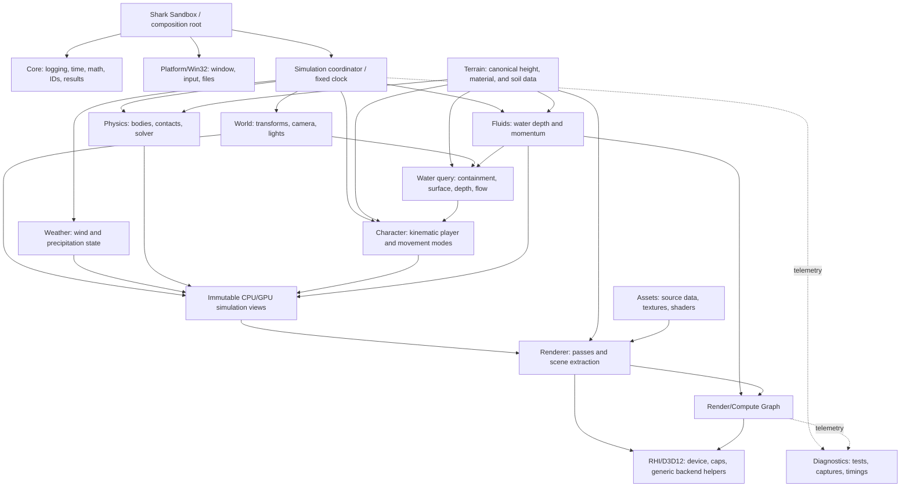

# Shark Engine Plan

- **Status:** Active working plan
- **Plan date:** July 11, 2026
- **Last updated:** August 4, 2026
- **Latest completed:** `DEMO-001` - playable Island Demo 0.1 slice
- **Next increment:** `GLTF-001` - load one original static glTF mesh

## 1. Project direction

Shark will be a Windows-first 3D graphics and physics simulation engine built
directly on modern Direct3D 12. It is not a general-purpose commercial engine.
The completed Environment and Simulation foundations already provide a sky,
daylight and HDR lighting, bounded natural terrain, a calm visual lake,
canonical terrain queries, fixed-step rigid-body physics, and a tested CPU
shallow-water solver.

The first playable goalpost is **Island Demo 0.1**:

- one original, bounded small-island environment with a dry spawn, traversable
  beach, graduated shallow shelf, and deeper swimmable water;
- one visible placeholder character controlled from a third-person camera;
- deterministic walk, run, jump, fall, land, slope, and shoreline behavior;
- dry, wading, and surface-swimming movement modes with reliable entry and
  exit;
- CPU-authoritative terrain and water queries that never wait for GPU data;
- the existing sky, sun, terrain materials, water presentation, diagnostics,
  and fixed-step simulation; and
- reproducible Debug/Release behavior and clean D3D12 validation.

The demo deliberately does not require combat, enemies, party AI, dialogue,
quests, underwater free-swimming, rain, dynamic hydrology, streaming, or
production character assets. Those are later proposals, not hidden work inside
the first checkpoint.

The visual-rain track (`R-001` through `R-004`), GPU shallow-water work
(`W-005` and `W-006`), and coupled hydrology remain approved Shark
specializations but are no longer on the critical path to Island Demo 0.1.
The W-002 through W-004 CPU solver remains useful research and a future source
for simulated shorelines; ordinary character swimming needs a deterministic
water-volume query and movement state, not a full fluid simulation.

### Long-term capability ceiling

Shark's outward feature breadth is capped at a **bounded, zone-based,
single-player third-person action-RPG/platformer**: the observable functional
envelope demonstrated by the original 2002 PlayStation 2 release of *Kingdom
Hearts*, implemented independently with modern technology and original
content. “Kingdom engine” is useful shorthand for the owner's target, not a
claim that Shark knows or reproduces Square's undocumented internal
architecture.

Within that ceiling, later proposals may cover:

- authored outdoor and indoor zones with explicit transitions, local LOD, and
  bounded scene populations;
- stylized terrain, water, props, particles, skinned characters, animation,
  lighting, and ordinary environmental effects;
- one authoritative local simulation with a controllable third-person
  character, platforming, interactions, surface swimming, and a distinct later
  underwater movement mode;
- lock-on action combat, abilities, simple magic/items, enemies, party members,
  and bounded navigation/behavior;
- scripted encounters, dialogue, cutscenes, progression, inventory, HUD,
  save/load, input, audio, and scene transitions; and
- focused import and scenario-authoring tools justified by those features.

This ceiling limits **feature breadth**, not implementation quality. Shark may
use C++20, Direct3D 12, PBR materials, HDR lighting, higher precision,
deterministic tests, modern accessibility and input practices, current asset
formats, and stronger diagnostics. It does not intentionally reproduce
PlayStation 2 limitations.

The reference is shipped player-facing behavior, not proprietary
implementation detail. Shark will not seek Square Enix, Disney, *Kingdom
Hearts*, or character/world source, assets, formats, binaries, behavior cloning,
save compatibility, or mod compatibility. Island Demo 0.1 must be an original
scenario rather than a Destiny Islands replica.

The goalpost changed on July 25, 2026 from an environment-first technology
sequence to the playable island slice above. No completed work is discarded:
the renderer, terrain, lake, canonical queries, capsule/box/sphere collision,
contact solver, broad phase, sleeping, and W-002 through W-004 fluid oracle all
support the new direction. Region-scale open-world streaming, vehicles,
traffic, crowds, and radio are removed from the promised capability envelope.

## 2. Working agreement

Every implementation step is a small, independently understandable increment.
For each increment:

1. We agree on one outcome and its explicit non-goals.
2. Codex implements only that scope and runs the relevant checks.
3. Codex reports the changed files, visible result, checks run, limitations, and
   one suggested commit message.
4. The repository owner reviews `git diff`, stages the desired files, commits,
   and pushes manually.
5. Work on the next increment starts only after the owner confirms the handoff.

Codex will not stage, commit, push, rebase, merge, or alter remotes unless the
owner explicitly asks for that operation. Generated build output, downloaded
dependencies, asset caches, captures, and logs will never be proposed for a
commit.

An increment is complete only when:

- it delivers one observable behavior or one cohesive infrastructure change;
- Debug and Release still build once those configurations exist;
- relevant automated tests pass;
- graphics changes produce no D3D12 debug-layer errors;
- changed decisions are reflected in documentation;
- the diff contains no unrelated refactoring or formatting; and
- the owner has a clear way to reproduce the result.

There is no arbitrary line-count limit. Direct3D 12 setup can be verbose; the
test is whether the change can be reviewed, verified, and reverted on its own.

## 3. Simulation honesty levels

The roadmap labels effects so visual realism is not confused with physical
simulation:

| Label | Meaning | Example |
|---|---|---|
| **V - Visual** | Convincing appearance without a conserved physical state | Rain streak particles or normal-mapped water |
| **S - Simulated** | A real-time mathematical model advances meaningful state | Rigid-body contact or shallow-water depth and momentum |
| **C - Coupled** | Two simulated systems exchange forces or conserved quantities | Rain adds measured water volume or water applies buoyancy |

We will first make an effect visible, then simulate it where that creates useful
behavior, and finally couple systems after each one is independently stable.

## 4. Technical baseline and durable decisions

These choices define the starting line. A later change requires a small
Architecture Decision Record (ADR) explaining why.

| Area | Decision | Reason |
|---|---|---|
| Platform | Windows 11, x64 desktop | Direct3D 12 is the purpose of the project; a cross-platform layer would slow the first vertical slice |
| Language | C++20 with MSVC `14.50` LTS (`v145`) strict conformance | Modern facilities on a three-year LTS compiler family |
| Windowing | Native Win32 | Minimal dependency surface and direct DXGI integration |
| Build | CMake 4.2+, `Visual Studio 18 2026` generator, and vcpkg registry commit `f87344cac03158cbf1467264565f1fd36b382a24` | Reproducible command-line and Visual Studio builds |
| Graphics API | Direct3D 12 behind a narrow Renderer/RHI boundary; typed resource handles remain future work | Keeps native D3D objects private without inventing an unneeded Vulkan abstraction |
| Product scope | Bounded zone-based single-player action-RPG/platformer at original PS2 *Kingdom Hearts* feature breadth | Focuses work on authored environments, character traversal, swimming, animation, and later combat rather than open-world breadth |
| Runtime | Retail DirectX 12 Agility SDK `1.619.4`, pinned in `F-002` | Current stable D3D12 runtime; preview SDKs stay off `main` |
| Shaders | HLSL compiled to DXIL by retail DXC `1.9.2602.24`, pinned in `F-002` | Reproducible Shader Model 6 builds and PIX source debugging |
| Required GPU baseline | Feature Level 12_0+ and Shader Model 6.0+ | Runs the first environment on a broad D3D12 hardware base with conventional descriptor tables |
| Modern GPU profile | Shader Model 6.6+ and Resource Binding Tier 3, capability-gated | Enables direct descriptor-heap indexing when material scale justifies a bindless path |
| Optional GPU techniques | Feature-query and enable individually only for an approved requirement | Feature Level 12_2, DXR, mesh shaders, VRS, and sampler feedback are internal options, never reasons to expand product scope |
| Barriers | Enhanced barriers when supported, legacy encoder fallback | Enhanced barriers are optional at the driver level |
| Rendering | Forward raster first, evolving to clustered Forward+ when needed | Sky, terrain, rain, and water do not justify a deferred renderer initially |
| Simulation | Fixed 60 Hz tick with render interpolation | Stable physics behavior independent of rendering frame rate |
| Physics | Shark-owned interface and initially limited custom solver | Lets us learn and control the simulation; a mature library may later serve as an optional backend or comparison oracle |
| Fluids | 2.5D shallow-water depth/momentum model first | Suitable for puddles, runoff, rivers, and flooding without the scope of full 3D fluid dynamics |
| Threading | Main-thread engine and direct GPU queue first | Correctness and instrumentation precede job systems and async compute |
| Content | Procedural or clearly licensed small test assets | Keeps the repository reproducible and legally clean |

Version pins are updated only in dedicated dependency increments. Preview
Agility SDKs, preview Shader Models, and experimental APIs belong on disposable
experiment branches, not on `main`.

### Initial dependency budget

Keep third-party code deliberately small and pin every dependency:

- retail DirectX 12 Agility SDK and DXC for the runtime and shader toolchain;
- retail `Microsoft.Direct3D.WARP` for a reproducible software-GPU smoke-test
  path;
- DirectX-Headers/`d3dx12.h` and DirectXMath for official API helpers and math;
- DirectXTex/`texconv` for offline texture preparation plus a small DDS runtime
  loader;
- WinPixEventRuntime for GPU event markers;
- `spdlog` for structured development logging; and
- Catch2 for CPU unit and integration tests.

D3D12 Memory Allocator may be added when placed-resource pools begin. Dear ImGui
waits until live simulation tuning needs a debug UI. A third-party physics engine
is not part of the initial solver; it may later be added behind the physics
boundary as a comparison oracle or optional production backend.

### Known development-machine constraints

The development machine is Windows 11 with both an NVIDIA discrete GPU and an
Intel integrated GPU. G-001 now enumerates adapters by high-performance
preference, logs every candidate, supports exact session-index selection, and
provides an explicit packaged-WARP smoke path. WARP is for correctness tests,
not performance validation.

The July 12 prerequisite check reports the `F-002` gate ready with no blocking
failures. Visual Studio 2026, MSVC 14.50 LTS, CMake 4.3.1, vcpkg, Windows SDK,
Graphics Tools, and Ninja are available. PIX remains a non-blocking requirement
only for manually inspecting G-007 captures; the marker runtime is restored by
the project. Global DXC is intentionally unnecessary because Shark restores a
pinned project-local copy. See
[Windows development setup](WINDOWS_SETUP.md).

## 5. World, math, and color conventions

These conventions are fixed before the first camera or shader:

- right-handed world coordinates;
- `+Y` is up, `+X` is right/east, and forward is `-Z`;
- meters, kilograms, seconds, radians, meters/second, and meters/second squared;
- rainfall represented physically as meters of water per second (equivalent to
  volume per area per second);
- Direct3D normalized depth range `[0, 1]` with reversed-Z;
- row-major CPU/HLSL matrices, row vectors, and `mul(vector, matrix)`; DXC uses
  the matching row-major flag;
- linear HDR scene lighting, with sRGB decoding for color textures and tone
  mapping only at final output;
- seeded random streams for repeatable simulation scenarios; and
- `float` local coordinates initially, with origin rebasing deferred until world
  scale demonstrates the need.

GPU particle and fluid results are tolerance-tested; bitwise cross-vendor
determinism is not promised.

## 6. Architecture

Shark begins as a **layered monolith**: clear module boundaries in one engine
library, not a collection of DLLs or tiny libraries. Targets are split only when
independent build or reuse value appears.

The diagram shows orchestration and one-way data flow. The simulation
coordinator calls stateful systems and publishes a snapshot; `World` and
`Physics` never depend on each other in a compile-time cycle.


```mermaid
flowchart TD
    App[Shark Sandbox / composition root]
    Core[Core: logging, time, math, IDs, results]
    Platform[Platform/Win32: window, input, files]
    Simulation[Simulation coordinator / fixed clock]
    World[World: transforms, camera, lights]
    Snapshot[Immutable CPU/GPU simulation views]
    Assets[Assets: source data, textures, shaders]
    Terrain[Terrain: canonical height, material, and soil data]
    Water[Water query: containment, surface, depth, flow]
    Weather[Weather: wind and precipitation state]
    Physics[Physics: bodies, contacts, solver]
    Character[Character: kinematic player and movement modes]
    Fluids[Fluids: water depth and momentum]
    Renderer[Renderer: passes and scene extraction]
    Graph[Render/Compute Graph]
    RHI[RHI/D3D12: device, caps, generic backend helpers]
    Diagnostics[Diagnostics: tests, captures, timings]

    App --> Core
    App --> Platform
    App --> Simulation
    Simulation --> World
    Simulation --> Weather
    Simulation --> Physics
    Simulation --> Character
    Simulation --> Fluids
    Terrain --> Physics
    Terrain --> Character
    Terrain --> Water
    Terrain --> Fluids
    World --> Water
    Fluids --> Water
    Water --> Character
    World --> Snapshot
    Weather --> Snapshot
    Physics --> Snapshot
    Character --> Snapshot
    Fluids --> Snapshot
    Snapshot --> Renderer
    Terrain --> Renderer
    Fluids --> Graph
    Renderer --> Graph
    Renderer --> RHI
    Graph --> RHI
    Assets --> Renderer
    Simulation -. telemetry .-> Diagnostics
    Graph -. telemetry .-> Diagnostics
```

### Module responsibilities

| Module | Owns | Must not own |
|---|---|---|
| `Core` | logging, assertions, results, time, IDs, math conventions, seeded RNG | window, D3D12, scene policy |
| `Platform/Windows` | Win32 window, messages, input, timing, file watching | renderer or simulation state |
| `RHI/D3D12` | device/capability/debug boundary plus generic frame-resource, device-access, and legacy-transition helpers | terrain, weather, physics, or scene-pass/timing policy |
| `RenderGraph` | pass/resource declarations, order, barriers, lifetimes, queue synchronization | scene mutation or gameplay decisions |
| `Renderer` | public renderer config/frame/status/stats, production frame pipeline, camera data, sky/terrain/water/rain passes, debug views, and private D3D12 presentation backend | authoritative physics or fluid state |
| `Assets` | CPU asset records, loading, derived-data keys, shader artifacts | frame scheduling |
| `World` | transforms, cameras, lights, scenario placement, immutable frame snapshots | raw GPU resources or terrain/water data ownership |
| `Simulation` | fixed clock, subsystem order, input/output exchange, snapshot publication | rendering passes or subsystem internals |
| `Terrain` | authoritative height/material/soil tiles and spatial queries | D3D12 resource ownership |
| `Water` | authored calm-water bodies and CPU containment, surface, bed, depth, and optional-flow queries | character movement policy, visual materials, or GPU resources |
| `Weather` | wind, precipitation rate, later temperature/humidity/evaporation drivers | terrain infiltration capacity or rain particles as physical rainfall |
| `Physics` | bodies, colliders, broad/narrow phase, contact solver, debug primitives | D3D headers or render meshes |
| `Character` | one kinematic player capsule, locomotion modes, controller state, and previous/current snapshots | platform input devices, terrain/water ownership, D3D headers, or render meshes |
| `Fluids` | water depth/momentum, solver, conservation accounting, coupling, and an optional CPU water-query adapter | presentation, character policy, or material decisions |
| `Diagnostics` | tests, scenario capture, debug HUD, timings, validation output | production simulation policy |

REN-001 completes the first durable renderer boundary. The public move-only
`shark::renderer::Renderer` owns `RendererConfig`, `RenderFrameData`,
`RenderStatus`, and `RendererStats`; the sandbox passes the existing
`shark::rhi::d3d12::Device` only at the composition root. There is no public
D3D12 `Presentation` class. Presentation and swap-chain operations continue in
the private `engine/renderer/src/d3d12` backend.

The renderer-owned production `frame_pipeline` composes 15 imports and the
`Terrain -> TexturedCube -> Skybox -> Water -> ToneMap` passes. Cube,
daylight, skybox, terrain, water, and tone-map scene helpers also live under
the private renderer D3D12 backend.

The renderer D3D12 backend owns the fixed scene-named timestamp query layout
and accumulator. The D3D12 RHI retains device access, generic frame-resource
state, and legacy transition recording without owning scene policy.

The platform-independent `HeightTileSurface` still owns a validated canonical
tile and cached bounds; height, exact triangle-normal, bounds, and ray queries
never read the smooth render mesh or a D3D12 resource. Only derived render data
and the query-derived diagnostic pin cross into `Renderer`. T-003's separate
platform-independent `MaterialPalette` produces two bounded visual layers and
three full-mip arrays. Material weights and sampled normals remain derived
presentation data and never alter canonical terrain queries.
T-004 adds a derived row-major `4x4` render layout over that same LOD0 surface:
16 `8x8`-cell chunks reference the unchanged 1,089-vertex stream through
contiguous 384-index ranges and carry exact sample-derived AABBs. The renderer
frustum-culls those AABBs without changing canonical query ownership.
T-005 adds one boundary-preserving 240-index coarse range per complete chunk
over the same vertices. Every chunk edge retains all canonical boundary
segments, so equal and mixed LOD choices match without skirts or stitch
variants. Exact continuous vertical deviation is bounded at `0.140625` meters
for the fixture, and a stateless relative-error proxy selects coarse only when
`error <= 0.008 * camera_distance_to_closed_AABB`.

T-006 scales this design without introducing streaming. It adds a separate
bounded resident capacity fixture with `241x241` samples at four-meter spacing:
a `960x960`-meter region containing 58,081 shared vertices and 225
`16x16`-cell render chunks. Its 345,600 LOD0 indices and 194,400 coarse indices
stay inside the global `R16_UINT` vertex-index domain. The surface payload is
2,473,944 bytes (2.359 MiB); the complete packed terrain resources are
2,537,652 logical bytes and require 2,621,440 bytes of committed D3D12
allocation. The current `33x33` fixture remains the permanent compact analytic
regression oracle. T-007 replaces only the capacity fixture's deliberately
simple heights with five fixed-point value-noise bands. The resulting
project-owned landscape has 25.82421875 meters of relief, all 115,200 LOD0
triangles at or below 12 degrees, an 11.251308698-degree maximum slope, and a
0.1171875-meter maximum coarse error without changing topology or resource
budgets. Its four-phase presentation smoke preserves the interactive overview
while finishing from a smoke-only near pose with one LOD0 and 60 coarse chunks,
so both packed D3D12 index ranges stay live. T-008 composes that untouched
rolling-height oracle with a deterministic Q8 basin post-process and publishes
scenario-owned spawn, footprint, core, and future-waterline metadata. The
composite checksum is `0x4890DE3E1AA063A9`; topology and resource sizes remain
unchanged. W-001 consumes that metadata for a presentation-only surface
without changing canonical terrain.

### Non-negotiable ownership rules

1. Full-resolution `HeightTileSurface` data is the single source of truth for
   future collision and the fluid bed. LOD0 rendering and queries use the same
   `v00 -> v11` cell split and planar interpolation exactly. T-005's one
   coarser visual LOD is a derived approximation with an exact measured error
   bound and never changes physics with camera distance.
2. Physics never reads a render mesh or Direct3D resource.
3. The character controller is kinematic and separate from dynamic rigid-body
   integration. It uses canonical CPU collision queries and never reads a
   render mesh.
4. Character water behavior consumes a platform-independent `WaterQuery`
   result containing support containment, surface height, canonical bed
   height, local depth, and optional flow. It never samples a renderer texture
   or waits for GPU readback. The first adapter is analytic calm water;
   simulated water may provide a later adapter.
5. Visual rain particles and physical rainfall share `WeatherState`, but particle
   count never determines water volume.
6. The fluid solver owns water state. Rendering receives a read-only snapshot or
   SRV and never mutates the simulation.
7. Render and compute passes declare GPU access to the graph. Individual systems
   do not issue ad hoc barriers or cross-queue waits.
8. Simulation publishes immutable previous/current snapshots. Rendering
   interpolates between them and never advances simulation.
9. No synchronous full GPU readback is allowed in the normal frame loop.

### Frame and simulation flow

```text
Poll input and platform events
  -> accumulate real elapsed time
  -> run zero or more fixed 60 Hz CPU ticks
       1. sample one tick-owned player action plus orbit/zoom command
       2. update weather and authored scenario state
       3. evaluate canonical terrain and CPU water queries
       4. advance the kinematic character, camera rig, dynamic physics,
          and world state
       5. optionally consume completed fluid queries or queue fluid work,
          never wait
       6. publish the immutable CPU simulation snapshot
  -> interpolate player/orbit render snapshots and terrain-clear the camera
  -> build render/compute graph
       1. optionally advance queued GPU fluid steps when W-005 resumes
       2. shadows/depth -> terrain/character/opaque -> sky -> water -> post/debug
  -> record, submit, present
```

Island Demo 0.1's gameplay-water source is the WQ-001 analytic calm-water query
entirely on the CPU. When the GPU solver resumes, its normal path remains
asynchronous: catch-up ticks reuse the latest completed compact query and never
stall for water. A synchronized mode exists only for focused verification.
This staggered order avoids an unstable circular solve; iterative two-way
coupling remains a later specialization.

## 7. Direct3D 12 renderer design

### Device and frame foundation

- Enumerate DXGI adapters using high-performance preference and expose
  `--adapter`, `--warp`, and a capability-report mode.
- Build a `RendererCaps` record using `CheckFeatureSupport`; never infer optional
  support from a feature-level number.
- Before device creation, enable the D3D12 debug layer, optional GPU-based
  validation, and DRED. Configure bounded `ID3D12InfoQueue` and
  `IDXGIInfoQueue` storage plus debugger-break policy without suppressing
  messages. GPU-based validation is an opt-in focused-test mode because it is
  expensive.
- Submission, fence, resize, and present failures query the device-removal
  reason and emit bounded DRED breadcrumb and page-fault details.
- Use a flip-model, triple-buffered swap chain and a reversed-Z depth target.
- Define direct, compute, and copy queue interfaces with monotonic fence
  timelines, but initially submit graphics, compute, and uploads on the direct
  queue. Activate copy or async-compute queues only after the graph owns their
  cross-queue fence handoffs and PIX demonstrates a benefit.
- Use a `FrameContext` per back buffer for command allocators, transient uploads,
  descriptors, timestamps, and a completion set containing every queue fence
  that guards reuse. G-003 establishes one allocator, bounded upload/CPU
  descriptor staging, and one direct-fence checkpoint per context while sharing
  one graphics command list. W-001 uses one fixed 12-query timestamp/readback
  slice per context, backed by one 36-query heap and one 288-byte buffer, and
  reuses each slice only after the same direct-fence checkpoint completes.
  Multi-queue completion sets remain later.
- Defer destruction of GPU resources, descriptors, pipelines, and upload storage
  until every relevant queue fence in their retirement set completes. G-003
  verifies whole-context transient reuse. G-005 creates one persistent root
  signature/PSO, cube vertex/index buffers, checker texture/SRV, and resize-owned
  depth target. S-002 adds a second immutable far-depth sky PSO; S-002A changes
  its visible content from the diagnostic cubemap to procedural daylight.
  T-001 adds terrain vertex/index buffers plus
  solid, wireframe, and bounds PSOs in the same bounded static-upload and
  startup lifetime. T-003 adds three material arrays and a dedicated terrain
  root signature while splitting the procedural sky onto its own b0-only root
  signature. S-003 adds four derived HDR environment textures, a resize-owned
  `R16G16B16A16_FLOAT` scene target, a material-sphere proof pipeline, and a
  final tone-map pipeline; shutdown releases every persistent object after the
  final drain.
  Generic fence-keyed deferred destruction remains later.

### Resources and descriptors

- Expose typed generational handles such as `BufferHandle`, `TextureHandle`,
  `SamplerHandle`, and `PipelineHandle`; raw COM pointers stay below the public
  renderer boundary in the D3D12 RHI or private renderer D3D12 backend.
- Start with committed resources and simple correctness. Add placed-resource
  pools and aliasing only after telemetry shows value.
- Keep persistent resources separate from graph-transient resources.
- Use one shader-visible CBV/SRV/UAV heap and one sampler heap with stable
  persistent indices; recycle slots only after their fences complete. Begin
  with conventional descriptor tables while keeping handles bindless-ready.
  G-005 proves the checker at shader-visible SRV slot 0 and one static sampler.
  S-001 retains the uploaded orientation cubemap at slot 1 as an asset-path
  proof. S-002A makes `Skybox` b0-only and removes that dormant texture from
  the per-frame graph. T-003 fixes albedo, normal, and roughness array SRVs at
  slots 2-4. S-003 fixes diffuse irradiance, prefiltered specular, split-sum
  BRDF LUT, radiance, and resize-owned HDR scene-color SRVs at slots 5-9.
  Terrain binds one contiguous six-entry material/IBL table, while sky, water,
  and tone mapping bind focused one-entry tables; the stable-index allocator
  remains future work.
- Keep CPU-only RTV and DSV allocators separate.
- Add upload and readback arenas, with a per-frame linear upload ring.
- Expose descriptor use and DXGI video-memory budget in diagnostics before
  texture streaming is attempted.

### Shaders and pipelines

- Compile HLSL at build time with pinned DXC and treat warnings as errors. G-004
  resolves only the vcpkg-restored retail DXC `1.9.2602.24`, compiles explicit
  `vs_6_0`/`ps_6_0` entry points with HLSL 2021, strict and row-major flags,
  emits per-configuration DXIL/C++ headers/PDBs, and tracks shared includes
  through depfiles.
- Retain shader PDB/debug data in developer builds for PIX. G-004 embeds source
  debug information while keeping Debug unoptimized and Release optimized.
- Begin with a small shared root-signature convention using descriptor tables and
  frame/pass constants. Direct heap indexing becomes a separate capability-gated
  increment only after Shader Model 6.6, Binding Tier 3, and a real scale need are
  confirmed. S-002A's frame CBV contains the row-major scene and
  translation-free sky matrices plus six packed daylight rows and is visible
  to vertex and pixel stages. The checker cube separately retains one
  single-SRV descriptor table and static sampler. T-003's terrain root adds
  material/view constants and one material table. S-003 extends that table to
  `t0..t5` for the three material arrays plus irradiance, prefiltered
  specular, and BRDF LUT; it also gives sky a radiance-cube table and adds a
  focused tone-map signature for the HDR scene SRV. This is not yet a
  versioned renderer-wide layout.
- Key shader artifacts by source/include hashes, entry point, target, defines,
  flags, compiler version, and root-signature version.
- Cache immutable PSOs by structural hash; never compile a surprise PSO in the
  middle of a render pass. G-005 creates one immutable cube/depth PSO
  synchronously during renderer startup; generalized artifact keys and PSO
  caching remain later. S-002 creates a second immutable skybox PSO from pinned
  build-time DXIL and never compiles pipeline state inside the frame loop.
  S-003 adds immutable material-sphere and tone-map PSOs without moving PSO
  compilation into the frame loop.
- Add development hot reload only after the offline build pipeline is reliable.

### Render graph growth

The graph is renderer infrastructure, not a scene API. G-006 establishes
whole-resource reads and writes, intended resource states, explicit and
hazard-derived dependencies, and an execution callback that can resolve only
its declared resources. Subresource ranges, attachment policy, and queue
preference remain later extensions.

It grows in three deliberate stages:

1. **Simple:** direct queue, imported committed resources, declaration
   validation, stable hazard-aware topological compilation, cycle rejection,
   and centralized legacy barrier encoding. W-001 keeps this first form and
   executes ordered `Terrain`, `TexturedCube`, `Skybox`, `Water`, and
   `ToneMap` passes with explicit HDR scene, environment, texture, and
   input-assembler reads.
2. **Managed:** lifetime analysis, graph-owned transient placed resources,
   resource pooling, subresource scopes, and aliasing.
3. **Optimized:** pass merging, parallel recording, and compute/copy scheduling
   only where PIX proves a benefit.

G-006 provides only a whole-resource legacy-barrier executor. A future
capability-gated increment may add an enhanced-barrier encoder; one model will
then be selected globally for the device lifetime rather than mixed casually
across resources or frames.

### Diagnostics from the first executable

- check every `HRESULT` and name every significant D3D12 object;
- add PIX markers around every pass and major upload; T-001 names the current
  `StaticSceneUpload`, `Frame`, `Terrain`, `TexturedCube`, and `Skybox`
  boundaries, S-003 adds `ToneMap`, and W-001 adds transparent `Water` after
  `Skybox`;
- expose per-pass CPU/GPU timestamps, draws, dispatches, descriptors, memory,
  and queue waits; S-003 reports direct-queue GPU intervals for the frame plus
  separate `Terrain`, `TexturedCube`, `Skybox`, and `ToneMap` intervals; W-001
  adds `Water`, while CPU timings and broader counters remain later;
- keep a WARP smoke path for device creation and a deterministic basic frame;
- treat zero debug-layer errors as an acceptance gate; and
- test real graphics on both the discrete and integrated adapters when their
  capabilities meet the declared baseline.

## 8. Environment and simulation design

### Sky

1. Load a small DDS cubemap and render it without camera translation (**V**).
2. Complete a bounded deterministic HDR path: generate one `64x32` linear
   latitude-longitude daylight source, convert it to a `32x32` six-mip
   radiance cube, derive an `8x8` diffuse-irradiance cube, a `32x32` six-mip
   GGX-prefiltered specular cube, and a `32x32` split-sum BRDF LUT, then light
   terrain and one material sphere from the same data (**V**, `S-003`).
3. Improve the bounded analytic sky and fog only when an approved scene needs
   it (**V**). Volumetric cloud and atmosphere simulation stay outside the
   default scope.

### Terrain and textures

1. Render one procedural or loaded height tile with solid/wireframe debug views.
2. Add exact CPU height, normal, bounds, and ray queries from the same data.
   T-002 completes this with an owning, validated `HeightTileSurface`, inclusive
   maximum footprint edges, float-rounded render-coordinate bracketing,
   deterministic triangle ties, metric rays with scale-relative triangle
   tolerances, and a visible query-derived normal pin.
3. Add PBR texture arrays and slope/height or painted blend weights.
4. Add chunks and frustum culling at full resolution. T-004 completes this
   with 16 exact-AABB chunks and conservative Direct3D frustum tests.
5. Add derived visual LODs with crack-free seams and measured error bounds.
   T-005 completes the bounded first step with one coarse level, identical
   equal/mixed boundary segments, exact continuous vertical-error measurement,
   and stateless distance selection.
6. Prove larger resident capacity without changing canonical ownership or
   index architecture. T-006 completes this with one separate
   `241x241`-sample, four-meter-spacing capacity region, the retained compact
   fixture for tests, a 1,500-meter far plane, scaled navigation, measured
   geometry/startup budgets, and `F4` chunk/query diagnostics that are off by
   default.
7. Shape that region with deterministic project-owned, multi-scale rolling
   terrain. T-007 completes this with five fixed-point value-noise bands seeded
   by `0x4FFB0830`, Q8 output, a locked `0xC0FB1097EBCB8B7B` height checksum,
   25.82421875 meters of relief, and all 115,200 triangles below the 12-degree
   acceptance limit. It avoids periodic seams, spikes, external assets, and
   unbounded procedural work.
8. Add a deterministic dry spawn and closed lake-like indentation near it.
   T-008 completes this with a validated warped spawn-side support component
   centered at `(-128,-128)`, a `-4`-meter future waterline, a closed raised
   rim, and a dry spawn overlooking the basin. It publishes those values as
   scenario metadata and stops before rendering or simulating water.
9. Add streaming, virtual texturing, render sections, wider indices, or
   mesh-shader meshlets only when measured scale or fidelity exceeds the
   bounded resident `R16_UINT` contract.

### Weather and rain

`WeatherState` owns wind and precipitation rate. The visual system turns those
values into a bounded camera-relative GPU particle field, streaks, impacts,
splashes, and a non-conserving wetness mask (**V**). Later, hydrology converts
the same precipitation rate into a measured source term for water cells (**C**).
The visual particle/splash/wetness work is currently deferred; the numerical
weather boundary remains available to later hydrology independently.

### Rigid-body physics

Start with semi-implicit Euler, terrain contact, spheres, capsules, and boxes.
Retain brute-force pair generation as the verification oracle for the bounded,
fixed-X sweep-and-prune broad phase. Add analytic primitive contacts,
sequential impulses, friction, and restitution before considering arbitrary
convex shapes, GJK/EPA, or CCD.

PHY-001 completed the timing and motion foundation: an initially paused fixed
60 Hz clock supports `F5` pause/resume and `F6` single-step, one collision-free
body advances under gravity with semi-implicit Euler, and rendering consumes an
immutable interpolation of previous/current snapshots through the existing
material sphere's `b2` translation.

PHY-002 established the first contact proof: the sphere consumed the exact
canonical LOD0 face below its center and corrected plane penetration without
changing X/Z ownership. At that increment's completion it settled through a
deliberately temporary infinite-friction endpoint projection independent of
render-rate partitioning. PHY-007 has since replaced that velocity response
with the shared friction/contact solver while retaining PHY-002's canonical
query and vertical-ownership contract. The visual lake remains
presentation-only.

### Water and fluids

The first water is explicitly visual. W-001 draws a procedural six-vertex
horizontal quad centered at `(-128,-4,-128)` with X/Z half-extents `64/56`.
The authoritative water support is the intersection of that local quad domain
with the warped `rho <= 1` inequality, selecting the intended spawn-side
component rather than treating the inequality as one globally bounded lobe.
Its visible shoreline is the waterline/depth-test intersection with canonical
terrain, so bank triangles may occlude a narrow edge. Premultiplied HDR
transmission and tint, an analytic depth proxy for absorption, Fresnel response,
environment reflection/refraction approximations, animated normal-only waves,
and bounded sun glint remain visual effects (**V**). There is no water texture,
geometry buffer, conserved state, or fluid simulation.

The first simulated fluid is a conservative 2.5D shallow-water grid storing
water depth and horizontal momentum (**S**). A small CPU reference solver comes
first with lake-at-rest, dam-break, dry/wet-front, wall, positivity, and mass
tests. A compute-shader version then matches the reference within documented
tolerances. Stability uses a CFL-limited timestep rather than hiding failures
with arbitrary velocity clamps.

The platform-independent fluid core owns the equations, configuration, CPU
reference, and validation. When the GPU solver arrives, a D3D12 fluid adapter
owns the GPU textures and registers compute work through the render/compute
graph. The renderer receives only declared read-only views of the result. Full
readback exists for focused tests, never as a normal per-frame dependency.

This model supports puddles, terrain runoff, rivers, and flooding. It does not
support overturning waves, jets, breaking ocean waves, or fine volumetric
splashes. FLIP, SPH, and full 3D Navier-Stokes solvers are outside Shark's
default scope and would require an explicit owner-approved plan amendment, not
an assumed future milestone.

Coupling proceeds in this order:

1. rainfall adds measured volume to sealed-basin water (**C**);
2. soil infiltration parameters and weather-driven evaporation become explicit
   boundary sinks with a mass ledger (**S**; no closed soil/atmosphere reservoir
   is claimed);
3. water moves across active terrain tiles (**S**);
4. a compact, versioned GPU query result reaches CPU physics asynchronously;
5. water applies approximate buoyancy and drag to bodies (**C**, one-way);
6. bodies become conservative moving-bed/free-volume boundaries for water
   (**C**, the other direction); and
7. the two directions run as stable, staggered coupling (**C**).

## 9. Planned repository layout

The first build increment may create only a subset of this tree. Empty
architecture folders are not committed merely to make the tree look complete.

```text
/
|-- apps/
|   `-- sandbox/               # Executable and subsystem composition
|-- engine/
|   |-- core/
|   |-- platform/windows/
|   |-- rhi/d3d12/
|   |-- render_graph/
|   |-- renderer/              # Public Renderer and private D3D12 scene backend
|   |-- assets/
|   |-- world/
|   |-- simulation/
|   |-- character/
|   |-- water/
|   |-- terrain/
|   |-- weather/
|   |-- physics/
|   |-- fluids/
|   |   `-- d3d12/
|   `-- diagnostics/
|-- shaders/
|   |-- shared/
|   |-- cube/                 # First camera/depth/resource-bound HLSL proof
|   |-- sky/                  # Static cubemap background HLSL proof
|   |-- terrain/
|   |-- rain/
|   `-- water/
|-- content/
|   |-- source/                # Small licensed source assets
|   `-- scenarios/             # Deterministic test scenes
|-- tools/                     # Asset tools when justified
|-- tests/
|   |-- fixtures/shaders/     # Isolated compiler-failure/rebuild probes
|   |-- unit/
|   |-- integration/
|   `-- gpu/
|-- cmake/                    # Toolchain, shader, and verification helpers
|-- docs/
|   |-- adr/
|   `-- milestones/
|-- scripts/
|-- CMakeLists.txt
|-- CMakePresets.json
|-- vcpkg.json
`-- vcpkg-configuration.json
```

Initially this produces three targets: `SharkEngine`, `SharkSandbox`, and
`SharkTests`. Module-specific static libraries are introduced only when the
dependency graph or build times justify them.

## 10. Increment roadmap

Each row is intended to become one owner-reviewed manual commit. A milestone is
a useful product checkpoint made from several such commits.

### M0 - Direction

| ID | Level | Increment and acceptance gate | Suggested commit |
|---|---:|---|---|
| `P-000` | - | Add this architecture, scope, ownership model, roadmap, and manual Git agreement | `docs: define Shark engine architecture and roadmap` |

### M1 - Reproducible foundation

| ID | Level | Increment and acceptance gate | Suggested commit |
|---|---:|---|---|
| `F-001` | - | Document the required MSVC, Windows SDK, CMake, and graphics tools; a check script reports actionable pass/fail results | `build: define Windows toolchain prerequisites` |
| `F-002` | - | Add CMake presets, pinned dependency manifests, `SharkEngine`, `SharkSandbox`, and one passing test; a fresh configure/build/test is documented | `build: add reproducible CMake project skeleton` |
| `F-003` | - | Add results, logging, assertions, and strict warnings; one intentional failure is covered by a unit test | `feat(core): add diagnostics foundation` |
| `F-004` | - | Open, resize, minimize, and close a Win32 window with a stable application loop and input/event boundary | `feat(platform): add Win32 application shell` |

### M2 - First pixels and skybox

This is the shortest responsible path to the first requested visual feature.

| ID | Level | Increment and acceptance gate | Suggested commit |
|---|---:|---|---|
| `G-001` | - | Initialize Agility/D3D12, choose the high-performance adapter, log capabilities, and start hardware/WARP with zero debug errors | `feat(gpu): initialize Direct3D 12 device` |
| `G-002` | V | Create a resize-safe flip swap chain and present a clear color for 1,000 frames without validation or live-object errors | `feat(gpu): present a clear-color frame` |
| `G-003` | - | Add three back-buffer-indexed frame contexts, a monotonic direct-queue fence, bounded per-context upload and CPU descriptor staging, and verify transient slots reset only after submission completes | `feat(gpu): add frame resource lifecycle` |
| `G-004` | V | Resolve retail DXC `1.9.2602.24` only from the manifest host tools; compile tracked `vs_6_0`/`ps_6_0` HLSL with warnings as errors; reject malformed/warning fixtures; create one immutable PSO; and record one three-vertex triangle draw per submitted frame | `feat(render): add the first HLSL pipeline` |
| `G-005` | V | Add the `+Y`-up/`-Z`-forward row-vector camera and right-drag/`WASD`/`QE`/`Shift` controls; render one 24-vertex/36-index cube with an `8x8` procedural checker through a root CBV plus one SRV/static sampler; and recreate a `D32_FLOAT`, clear-`0`, `GREATER_EQUAL` reversed-Z target safely across resize | `feat(render): add camera and depth conventions` |
| `G-006` | - | Add a frame-local, single-use direct-queue graph with move-safe owner-scoped imports/passes, explicit plus RAW/WAR/WAW dependencies, stable topological compilation, cycle and callback-access validation, and centralized whole-resource legacy barriers; run the existing cube as one `TexturedCube` pass with exactly two attachment transitions per submitted frame | `feat(render): add minimal render graph` |
| `G-007` | - | Link the pinned WinPixEventRuntime for Debug and Release markers; name `StaticCubeUpload`, `Frame`, and `TexturedCube`; partition one 12-query/96-byte timestamp/readback allocation into three four-query frame-context slices; consume only fence-complete results; and report validated frame/pass samples plus bounded query accounting without adding a normal-frame drain | `feat(diagnostics): add GPU frame instrumentation` |
| `S-001` | V | Load the project-owned `8x8` DX10 DDS orientation cube through a DirectXTex-isolated CPU boundary; reject ambiguous/malformed cube metadata, upload its six sRGB faces in the existing static submission, and create persistent cube SRV slot 1 without changing the visible frame | `feat(assets): load DDS cubemap textures` |
| `S-002` | V | Render the skybox as a named graph pass; camera rotation changes it, translation does not, and resize stays clean | `feat(sky): render a cubemap skybox` |

**M2 exit:** a camera moves through a stable cubemap sky scene; the frame is clean in
the debug layer and readable in a PIX capture.

### M3 - Terrain and materials

| ID | Level | Increment and acceptance gate | Suggested commit |
|---|---:|---|---|
| `T-001` | V | Render one deterministic height tile in solid and wireframe modes with inspectable normals/bounds | `feat(terrain): render a heightmapped tile` |
| `S-002A` | V | Replace the diagnostic cubemap's visible RGB with a continuous procedural LDR daylight gradient, soft sun disk/halo, and the same unshadowed ambient-plus-Lambert sun direction on terrain; retain the far-depth sky technique and return immediately to terrain queries | `feat(sky): add procedural daylight and sun` |
| `T-002` | - | Add exact height, normal, bounds, and ray queries; a marker rests on the visible LOD0 triangle surface | `feat(terrain): add canonical terrain queries` |
| `REN-001` | - | Complete: move scene-pass configuration, statistics, helpers, and production orchestration behind the public `Renderer` boundary without changing pixels or smoke accounting | `refactor(render): separate renderer orchestration from D3D12 RHI` |
| `T-003` | V | Complete: blend two project-owned ground/rock layers from matching `32x32`, six-mip albedo/normal/roughness texture arrays by deterministic slope and height; add world-XZ tiling, tangent-free normal mapping, direct-sun dielectric GGX, and material-weight/world-normal views | `feat(terrain): add layered PBR materials` |
| `S-003` | V | Complete: generate a deterministic `64x32` linear-HDR daylight source; derive a `32x32` six-mip radiance cube, `8x8` irradiance cube, `32x32` six-mip GGX specular cube, and `32x32` split-sum BRDF LUT; light terrain and one material sphere through an HDR scene target and final tone map; retain an `F3` procedural fallback | `feat(sky): add image-based environment lighting` |
| `T-004` | V | Complete: split the full-resolution fixture into 16 row-major `8x8`-cell chunks over one shared 1,089-vertex stream; conservatively frustum-cull their exact AABBs, draw one 384-index surface plus one 24-index magenta bound per visible chunk, and expose visible/total statistics | `feat(terrain): add chunk culling` |
| `T-005` | V | Complete: add one boundary-preserving 240-index coarse range per complete `8x8` chunk over the unchanged vertices; retain every edge segment for crack-free equal/mixed seams, measure exact continuous vertical error (`0.140625` m fixture maximum), and select statelessly from shortest camera-to-AABB distance while collision/queries remain full resolution | `feat(terrain): add bounded terrain LOD` |

**M3 exit achieved:** the user can fly over a textured outdoor terrain whose
renderer and CPU queries agree exactly at LOD0 and whose bounded coarse
presentation stays within the documented continuous vertical-error limit.

### M4 - Large natural terrain and visual lake

| ID | Level | Increment and acceptance gate | Suggested commit |
|---|---:|---|---|
| `T-006` | V | Complete: add a separate bounded resident capacity region with `241x241` samples at four-meter spacing (`960x960` meters), 225 `16x16`-cell chunks, 58,081 shared vertices, 345,600 LOD0 indices, and 194,400 boundary-preserving coarse indices; retain the compact fixture as the regression oracle, stay on global `R16_UINT`, scale the camera/smoke contract, and verify a 2,473,944-byte surface payload, 2,621,440-byte committed D3D12 allocation, and 6,049.240/82.738-ms Debug/Release CPU build | `feat(terrain): add bounded large terrain region` |
| `T-007` | V | Complete: replace the capacity region's checker heights with five fixed-point, fixed-seed, project-owned value-noise bands; lock exact sample anchors and FNV-1a checksum `0xC0FB1097EBCB8B7B`, bound offsets to `-12.30078125..13.5234375` meters and relief to `25.82421875` meters, keep all 115,200 triangles at or below 12 degrees with an `11.251308698`-degree maximum, retain T-006 topology/resources, and finish the smoke at a `61 (1/60)` near pose so both D3D12 index ranges remain exercised; add no lake, erosion, vegetation, roads, or external height asset | `feat(terrain): generate natural rolling landscape` |
| `T-008` | V | Complete: compose the unchanged T-007 rolling oracle with a deterministic Q8 basin post-process; publish a validated warped approximately `112x96`-meter spawn-side support component centered at `(-128,-128)` and a `-4`-meter future waterline; lock composite checksum `0x4890DE3E1AA063A9`, a `(-124,-10.47265625,-128)` core, a complete `-2.5`-meter spill rim, and a dry spawn at `(-128,1.34375,-20)` about 58.5 meters outside the support boundary; retain topology/resources and render no water | `feat(terrain): add spawn-side lake basin` |
| `W-001` | V | Complete: draw one procedural six-vertex flat quad at T-008's `-4`-meter waterline, define the spawn-side water support as its local `64/56` X/Z half-extent domain intersected with warped `rho <= 1`, composite it after the sky, and let reversed-Z testing against canonical terrain form the shoreline; add premultiplied HDR transmission/tint, analytic depth-proxy absorption, Fresnel, environment reflection/refraction approximations, animated normal-only waves, and sun glint while retaining four geometry buffers, ten persistent descriptors, and no water texture/resource or simulated state | `feat(water): render a visual lake surface` |

**M4 exit / Environment Lab 0.1:** the camera starts on dry natural terrain
overlooking a visually convincing static lake inside a bounded `960x960`-meter
resident region. Canonical queries, culling, LOD seams, resource budgets, and
frame/pass timings remain measured and clean.

The deferred visual-weather track is listed in Section 12 and does not block
M5.

### M5 - First physics

| ID | Level | Increment and acceptance gate | Suggested commit |
|---|---:|---|---|
| `PHY-001` | S | Complete: add an initially paused fixed 60 Hz clock, `F5` pause/resume, `F6` single-step, standard gravity, semi-implicit collision-free motion invariant across render rates, immutable previous/current interpolation, and a three-constant `b2` translation for the existing material sphere | `feat(physics): add deterministic fixed-step motion` |
| `PHY-002` | S | Complete: give the scenario-owned one-meter sphere a transactional one-sample face-plane response against `HeightTileSurface`; correct vertically without changing canonical X/Z ownership, settle through an explicit temporary infinite-friction endpoint projection, retain exact triangle metadata, retarget the bounded `F4` cyan pin to its fixed support sample, and prove real-scenario support, flat rest, slope clearance/normal, tolerance, diagonal/edge ownership, invalid input, and 30/60/120/144 Hz invariance | `feat(physics): add sphere terrain contact` |
| `PHY-003` | S | Complete: publish exactly four scenario spheres in stable previous/current arrays; test six pairs in lexicographic brute-force order; split overlap between equal unit masses; apply approaching-only normal impulses with explicit `0.75` Environment Lab restitution; retain the isolated canonical-terrain proof; collide the first pair while airborne; and render four existing-mesh draws by rebinding `b2` without another resource, descriptor, or pass | `feat(physics): add sphere body collisions` |
| `PHY-004` | S | Complete: extend the fixed snapshots with unit quaternions and world-space angular velocity; publish explicit equal solid-sphere mass/inertia; integrate torque semi-implicitly through normalized axis-angle increments; shortest-path interpolate render orientation; drive an inspectable local material marker through seven `b2` constants; and preserve all linear terrain/pair behavior without angular contact impulses | `feat(physics): add angular rigid-body state` |
| `PHY-005` | S | Complete: add a finite local-half-segment capsule collider; derive world endpoints from normalized rigid orientation; add a bounded canonical LOD0 segment/triangle closest-feature query; generate pure capsule/terrain, capsule/sphere, and capsule/capsule contacts with signed separation, penetration depth, stable witnesses, one-sided terrain normals, and deterministic degenerate-feature fallbacks; and prove the analytic contracts without adding a solver or render proxy | `feat(physics): add capsule collision` |
| `PHY-006` | S | Complete: add finite positive-half-extent oriented boxes; derive checked world axes, sign-bit vertices, and bounds from normalized rigid orientation; test all 15 box/box and 13 box/canonical-triangle SAT axes in stable order; generate deterministic face-clipped or edge-pair witnesses in fixed-capacity manifolds of at most four points; retain exact terrain ownership through a bounded row-major triangle query; and prove the CPU geometry without adding response or a misleading render proxy | `feat(physics): add box contact manifolds` |
| `PHY-007` | S | Complete: add a fixed-capacity four-body/ten-constraint/four-point solver with explicit inverse mass, local inverse inertia, static endpoints, material restitution/friction, and one-to-32 stable iterations; accumulate normal and world-tangent impulses with one captured restitution target and a Coulomb static/dynamic cone; apply off-center angular response plus deepest-point, slop-aware, inverse-mass-weighted bounded translation; commit only after double-precision scratch state and reports fit finite floats; route canonical-terrain and lexicographic sphere-pair response through the shared path while retaining the four-sphere render and smoke budgets; and prove analytic momentum, restitution, friction, slope, angular, correction, order, rollback, and fixed-step behavior without persisting impulses between calls | `feat(physics): add contact constraint solver` |
| `PHY-008` | S | Complete: add unique generation-bearing endpoint/shape identities, exact dynamic-local/static-world witness anchors, a sorted fixed 30-manifold cache with deterministic point matching and bounded absence retention (one tick by default), pre-solve restitution capture, reprojected and friction-clamped normal/tangent warm starts, and atomic body/cache transactions; add checked uniform-box mass/inertia plus shape-neutral momentum-form angular integration; and prove analytic cache behavior plus a real three-cube stack across exact 30/60/120/144 Hz partitions without damping, locked rotation, sleeping, or renderer work | `feat(physics): stabilize persistent contacts` |
| `PHY-009` | S | Complete: add a shape-neutral fixed-X sweep-and-prune boundary with 64 stable-ID proxies, closed finite world AABBs, complete 2,016-candidate capacity, canonical pair order, and deterministic proxy/possible/X-overlap/candidate/narrow/contact counters; route the four-sphere adapter through outward-rounded conservative bounds and exact candidate-only narrow phase; and prove oracle equivalence, ordering, touching, validation, rollback, and fixed-rate behavior without embedding a wall-clock timer in Physics | `perf(physics): add collision broad phase` |
| `PHY-010` | S | Complete: build deterministic exact-contact islands within the existing four-body/ten-constraint solver bounds; key canonical island/member order and a compact sorted sleep registry by stable generation-bearing IDs; keep static world contacts inside one dynamic island without joining bodies through the world; preserve caller constraint order in active masks; separate pure wake preparation from atomic fixed-tick commit; require 60 complete quiet ticks at or below `0.05` m/s and `0.05` rad/s by default; propagate explicit activity across whole islands without damping or activity-tick aging; zero only the two velocity vectors on a whole-island sleep transition; and prove malformed-plan rollback, identity reuse, wake isolation, fixed-rate invariance, and exact awake solver results without changing the sandbox | `perf(physics): add body islands and sleeping` |

### M6 - Fluid simulation

| ID | Level | Increment and acceptance gate | Suggested commit |
|---|---:|---|---|
| `W-002` | S | Complete: add an allocation-free double-precision `8 x 8` CPU oracle with separate canonical bed and conserved `h/hu/hv` state, an exact row-major prefix and positive-zero tail, finite/nonnegative/dry-state gates, cardinal reflective solid-wall ghosts, fully wet lake-at-rest construction over an exact canonical-terrain cell-average bed, and deterministic volume/momentum diagnostics; prove the hydrostatic fixture without claiming a time update, wet-front policy, GPU work, or W-001 coupling | `feat(fluids): add shallow-water reference state` |
| `W-003` | S | Complete: add a transactional, unsplit, first-order CPU finite-volume advance over the W-002 strictly wet state; share hydrostatically reconstructed Rusanov mass fluxes with side-specific bed-pressure corrections; recompute scale-safe X/Z signal rates for bounded `CFL <= 0.5` substeps that land on the exact requested interval; reject dry, nonpositive, nonfinite, range, ledger, and budget failures without clamps or caller mutation; publish an enforced scale/operation-aware volume ledger and diagnostic report; and prove non-unit analytic fluxes, uneven lake at rest, long sealed dam break, X/Z and full `8 x 8` two-dimensional determinism, range edges, and post-work rollback without GPU or W-001 integration | `feat(fluids): advance wet shallow water` |
| `W-004` | S | Complete: define a binary-exact `2^-20`-meter dry-depth threshold and strict exact-dry/retained-film/active classes; retain every positive depth and its hydrostatic pressure while projecting only near-dry momentum to positive zero with an explicit integrated discard ledger; admit dry inputs and reconstructed dry faces through range-safe hydrostatic reconstruction; activate and deactivate through shared conservative fluxes without depth clamps; preserve transactional CFL and volume gates; and prove partially wet uneven lake-at-rest shorelines, analytic one- and two-dimensional fronts, analytic retreat, strict adjacent-value thresholds, mixed-front determinism, extreme dry no-op and rounded-zero-CFL ranges, non-unit momentum accounting, and post-projection rollback without GPU or W-001 integration | `feat(fluids): add wet and dry boundaries` |
| `W-005` | S | Deferred after W-004: port fixed-step batches to ping-pong compute resources; match CPU cases within tolerance and detect NaN/Inf/negative depth | `feat(fluids): add GPU shallow-water solver` |
| `W-006` | S | Deferred with W-005: render `terrain height + water depth`; simulated surface normals and velocity drive visual detail/foam | `feat(water): render simulated surface water` |

**M6 CPU checkpoint achieved:** W-004 provides the tested wet/dry reference
solver. The GPU solver and simulated-surface rendering remain approved but do
not gate character wading or swimming.

### M7 - Playable island

Each row remains one owner-reviewed commit. General entities, an ECS,
production skeletal assets, combat, underwater movement, and dynamic fluid
coupling are outside this first playable path.

| ID | Level | Increment and acceptance gate | Suggested commit |
|---|---:|---|---|
| `ISL-001` | V | Complete: retain the Environment Lab and numerical fixtures while adding a separate Q8 island over the existing `241x241` topology; lock checksum `0x53DD2821AE9ACDEA`, one connected dry component, a dry spawn and continuously walkable loop, a fully submerged perimeter, and a dry/shallow/transition/swim transect; make it the no-argument sandbox scenario and extend the existing 20-DWORD, six-vertex water path with a validated outside-footprint support mode that adds no pass, texture, descriptor, resource, or simulated state | `feat(terrain): add playable island scenario` |
| `WQ-001` | - | Complete: add a `Water -> Core/Terrain` CPU boundary with scenario-authored inside/outside warped-footprint support, equilibrium surface height, strict positive `1/256`-meter shoreline depth tolerance, optional horizontal flow, and explicit out-of-terrain/no-water/water results; sample only canonical LOD0 triangle bed height, return checked nonnegative depth, map the neutral support side to the unchanged renderer at the composition root, and prove invalid input, inclusive footprint boundaries, tolerance-adjacent terrain, Island Demo depth bands, terrain edges, and deterministic repeats without GPU access or character policy | `feat(water): add gameplay water queries` |
| `CHR-001` | S | Complete: add one Core-only bounded upright player capsule, named keyboard/mouse action commands sampled once per emitted fixed tick, transactional previous/current snapshots, exact dry-spawn/reset behavior without interpolation smear, and a blue temporary proxy that reuses the existing material-sphere geometry and Terrain pass; prove invalid-state rollback plus exact command/snapshot transcripts across 30/60/120/144 Hz without adding a general entity system, locomotion, camera follow, terrain contact, or water policy | `feat(character): add player capsule state` |
| `CAM-001` | V | Complete: add an interpolated fixed-tick third-person follow/orbit rig with camera-relative horizontal basis, bounded pitch/distance, once-per-tick wheel zoom, and a canonical-LOD0 clearance probe that shortens only the presentation boom; retain the exact scripted smoke camera and expose the former free-fly controller through `F7` without changing character authority | `feat(camera): add third-person follow camera` |
| `CHR-002` | S | Complete: add standard gravity, exact canonical-face support with slope-correct upright-capsule clearance, inclusive walkable-slope classification, stable grounded and steep-contact states, falling, one-tick landing, terrain-aware spawn/reset, and lifecycle interpolation collapse; prove edge ownership, rollback, camera follow, and exact 30/60/120/144 Hz transcripts without horizontal control | `feat(character): add terrain grounding` |
| `CHR-003` | S | Complete: add authoritative fixed-tick horizontal velocity, `4/7 m/s` walk/run targets, `24 m/s²` acceleration, `32 m/s²` braking, bounded shortest-arc facing, and camera-relative intent from the newly advanced orbit yaw; traverse canonical terrain with deterministic probes no farther than `0.25 m` apart, retain the safe prefix and stop at steep/missing/out-of-bounds support, and prove the complete eight-point island loop plus exact 30/60/120/144 Hz transcripts without claiming an exact swept capsule | `feat(character): add grounded locomotion` |
| `CHR-004` | S | Complete: add a `6.5 m/s` pre-gravity jump launch, `12 m/s^2` camera-relative airborne control weaker than ground acceleration, exact neutral momentum preservation, explicit rising/falling phases, ignored airborne jump pulses, sampled three-dimensional canonical-terrain contacts, one-tick landing, and canonical dry-spawn recovery; prove apex, no double jump, landing, reset/fall recovery, camera follow, terrain bounds, and exact 30/60/120/144 Hz transcripts without claiming exact continuous collision detection | `feat(character): add jumping and landing` |
| `CHR-005` | S | Complete: consume one tick-start WQ-001 observation at authoritative X/Z per emitted fixed tick; enter wading at `0.25 m`, remain wading until depth is `<= 0.125 m`, and linearly scale supported ground speed from `1.0` at `0.25 m` to `0.5` at `1.5 m` with deeper water clamped to `0.5`; require exact canonical-bed agreement, classify only grounded/landing support as wading, publish dry state for jump/air/steep/reset/recovery, and prove next-tick shore reclassification without water mutation, GPU access, flow response, or a deep-water barrier | `feat(character): add shallow-water wading` |
| `CHR-006` | S | Complete: enter surface swimming from sufficiently deep supported wading at `1.50 m` and retain it until depth is `<= 1.25 m`; hold the capsule center at `max(surface - 0.50 m, canonical support)`, move camera-relative at one `3 m/s` speed with Shift ignored, reuse ground acceleration/braking/facing/probes and terrain safe-prefix rejection, let a wading jump win while ignoring Space during swimming, capture descending deep-water motion at the surface while leaving rising motion unchanged, and recover deterministically from no-water, missing-support, reset, and time-baseline discontinuities without per-probe Water queries, GPU access, flow response, renderer changes, or underwater movement | `feat(character): add surface swimming` |
| `AVT-001` | V | Complete: replace the diagnostic capsule with one original code-native six-part placeholder (torso, head, two arms, and two legs); derive bounded idle/walk/run/jump/wade/surface-swim poses only from immutable previous/current controller snapshots and fixed ticks, blend with the player render alpha, collapse pose history with controller discontinuities, and reuse the existing mesh/pipeline/pass/resources while retaining Character motion as sole authority and deferring skeletal/glTF assets and production art | `feat(character): render placeholder avatar` |
| `DEMO-001` | - | Complete: add one shared 3,060-tick Island Demo acceptance journey through the real fixed clock, third-person orbit/basis, gameplay-water query, Character controller, camera/avatar composition, and canonical terrain; pin transcript checksum `0xCB461C6060881554`, prove exact 30/60/120/144 Hz results, one jump/landing and one dry/wade/swim/wade/dry sequence without reset, teleport, penetration, NaN, or duplicate transition, and submit all six accepted avatar-phase checkpoints through clean hardware/WARP presentation validation without changing normal interactive play | `feat(demo): complete playable island slice` |

**M7 checkpoint achieved / Island Demo 0.1:** one original character can traverse one original
small island and reliably transition between land, shallow water, and surface
swimming.

### M8 - Coupled environment specialization

This former M7 track remains approved after the playable island. It is not a
prerequisite for character swimming.

| ID | Level | Increment and acceptance gate | Suggested commit |
|---|---:|---|---|
| `C-001` | C | Feed measured rainfall to water; a sealed basin gains the expected volume within an agreed tolerance | `feat(hydrology): couple rainfall to surface water` |
| `H-001` | S | Add terrain-driven infiltration and weather-driven evaporation as explicit boundary sinks; the mass ledger accounts for every removed unit | `feat(hydrology): add water boundary fluxes` |
| `C-002` | S | Add active wet tiles and cross-tile runoff without seams or unexplained mass loss | `feat(hydrology): add tiled terrain runoff` |
| `C-003` | - | Produce a compact, versioned GPU fluid-query/readback ring for body sample points; CPU consumes only completed older data with no frame stall | `feat(fluids): add asynchronous physics queries` |
| `C-004` | C | Apply one-way Archimedes buoyancy and drag from the delayed query snapshot; a test block floats stably across frame rates | `feat(fluids): add body buoyancy and drag` |
| `C-005` | C | Represent static body occupancy as effective moving-bed/free-volume data without deleting water; visualize excluded volume and boundaries | `feat(fluids): add conservative body occupancy` |
| `C-006` | C | Add moving no-penetration boundary fluxes and conservative redistribution; the staggered floating-block case stays stable within mass tolerance | `feat(fluids): couple moving body displacement` |

**M8 exit:** the permanent integration scenario is "measured precipitation
fills a terrain bowl and a block floats in it," with conservation, stability,
and performance metrics. Visual rain particles are not required for this
physical source term.

## 11. Verification strategy

| Area | Permanent checks |
|---|---|
| Core/build | Fresh configure, Debug/Release build, unit tests, warnings as errors |
| D3D12 | Debug layer clean, focused GPU validation, DRED path, WARP smoke, named PIX passes |
| Camera/cube | Basis and near/far math, fixed-tick third-person orbit/zoom interpolation, bounded pitch/distance, canonical-terrain boom clearance, exact 30/60/120/144 Hz transcripts, diagnostic free-fly input, aspect-changing resize, and the retained 24/36 cube contract |
| Sky/assets | Cubemap orientation, translation invariance, sRGB/linear correctness, missing-asset error |
| Terrain | Flat/ramp samples, ray and finite-segment closest-feature hits, normals, cell/chunk boundary equality, LOD seam captures, resident-region index/memory budgets, deterministic natural-height metrics, and closed-basin/spawn assertions |
| Island | One connected landmass, closed coastline, dry spawn, traversable route, graduated shallow shelf, bounded deep-water region, and deterministic fixture checksum |
| Character/camera | Fixed-tick command sampling, grounding, slopes, walk/run/jump, interpolation, camera obstruction, invalid-state rollback, and 30/60/120/144 Hz render invariance |
| Water gameplay | CPU containment/surface/bed/depth queries, character-side immersion classification, threshold hysteresis, wading, surface-swim entry/exit, shore recovery, and no GPU synchronization |
| Demo integration | Golden fixed-tick journey/checksum, exact 30/60/120/144 Hz witnesses, one jump and water-transition sequence, continuous support/finite/displacement checks, shared camera/avatar roots, and six accepted avatar phases submitted by hardware/WARP smoke |
| Rain | Seed repeatability, capacity bounds, emission statistics, impact height, GPU timing |
| Physics | Gravity trajectory, resting contact, analytic sphere/capsule closest features, full oriented-box SAT/manifold geometry, slope friction, restitution, stack stability, canonical islands, sleep/wake transitions, awake-path identity, rollback, and NaN scan |
| Fluids | Lake at rest, dam break, walls, wet/dry front, non-negative depth, mass accounting, CPU/GPU tolerance |
| Coupling | Sealed-bowl rainfall volume, cross-tile runoff, floating block, displacement conservation |

Image tests and GPU numeric comparisons use documented tolerances because drivers
and floating-point execution differ across GPU vendors. Simulation scenarios use
fixed seeds and record their configuration so failures can be replayed.

## 12. Capability ceiling and deferred systems

The original-PS2-action-RPG ceiling is a maximum envelope, not a backlog.
Nothing in this section competes with the playable-island critical path through
M7.

### Deferred simulated-water track

`W-005` and `W-006` remain the next numerical-fluid increments when that track
resumes. They are a Shark specialization rather than proof required for
character swimming. WQ-001 established the calm analytic adapter boundary so
simulated water can replace its surface/flow source later without changing
character policy.

### Deferred visual-weather track

The owner deferred these effects on July 19, 2026. They remain approved but
have no position on the active playable-island path. Resuming one requires a
small plan update; skipping them does not remove the numerical precipitation
rate used by later hydrology.

| ID | Level | Deferred increment and acceptance gate | Suggested commit |
|---|---:|---|---|
| `R-001` | V | Add seeded, bounded GPU rain driven by adjustable rate and wind; terrain impacts are correct and particle capacity is fixed | `feat(weather): render wind-driven rain` |
| `R-002` | V | Turn terrain impacts into bounded splash/ripple events with repeatable placement and lifetime | `feat(weather): add rain impact splashes` |
| `R-003` | V | Add a non-conserving visual wetness mask with explicit accumulation and drying controls | `feat(weather): add visual terrain wetness` |
| `R-004` | V | Add rain density/overdraw controls and record GPU timing at low/medium/high quality | `perf(weather): add scalable rain quality` |

### Admission rule for future proposals

A new capability enters the roadmap only when:

1. it directly advances an existing M1-M8 gate or maps to one of the bounded
   action-RPG categories below;
2. it remains bounded to authored zones and one local single-player
   simulation;
3. any modern GPU or simulation technique serves that approved behavior rather
   than becoming a new product goal; and
4. it can be divided into small increments with observable acceptance gates.

If a proposal fails or ambiguously satisfies that test, it stays out until the
owner explicitly amends this plan.

### Eligible after Island Demo 0.1

Later proposals are eligible for planning when they directly support one of
these bounded outcomes:

- stable entity handles, scenario/save serialization, authored-zone loading,
  and explicit exterior/interior transitions;
- a project-owned glTF skeletal-asset path, animation sampling/blending, and
  richer traversal actions such as ledge hanging or climbing;
- a distinct underwater free-swim mode and later underwater-aware combat;
- lock-on melee, abilities, magic/items, damage, enemies, party members,
  bounded navigation, and simple behavior;
- triggers, interactions, scripted encounters, dialogue, cutscenes,
  progression, inventory, HUD, save/load, and audio; or
- focused import, animation, scenario, encounter, and dialogue-authoring tools.

The owner has delegated the post-demo choice to the project driver. The first
selected proposal is deliberately CPU-only and reviewable:

| ID | Level | Selected increment and acceptance gate | Suggested commit |
|---|---:|---|---|
| `GLTF-001` | - | Load and validate one project-owned, original static glTF 2.0 mesh into deterministic renderer-neutral indexed vertex data with explicit meter/right-handed conversion, node transform, primitive/accessor/buffer bounds, calculated bounds, and malformed-fixture tests; log the accepted asset but stop before GPU upload, rendering, skins, joints, animation, morph targets, broad material support, or a general content database | `feat(assets): load a static glTF mesh` |

Each still requires its own small roadmap increments and acceptance tests. The
list defines what may eventually be proposed; it commits Shark to none of them
yet.

### Explicitly outside the planned product

- networked multiplayer, replication, matchmaking, user accounts, live-service
  infrastructure, or an online economy;
- a general-purpose commercial editor, plug-in marketplace, arbitrary game
  genres, or a public compatibility layer for another engine;
- seamless region-scale open worlds, general vehicles/traffic, infinite
  procedural or planet-scale worlds, massively simulated societies, or
  unbounded crowds;
- fully destructible environments, production soft bodies, cinematic
  destruction, or general volumetric physics;
- procedural atmosphere as a product pillar, volumetric cloud simulation,
  erosion, ocean simulation, FLIP, SPH, or full 3D Navier-Stokes fluids;
- VR/AR, photorealistic feature chasing, or hardware feature checklists that do
  not solve an approved action-RPG requirement; and
- proprietary Square Enix, Disney, or *Kingdom Hearts* formats, assets, code,
  characters, worlds, behavior cloning, or binary/mod/save compatibility.

Custom allocators, a job system, parallel command recording, async compute,
arbitrary convex collision, GJK/EPA, CCD, virtual texturing, DirectStorage,
mesh shaders, sampler feedback, VRS, DXR, and work graphs are implementation
options rather than product goals. Any one may enter only through a measured
need from an approved system, with a baseline comparison, capability check,
fallback policy, tests, PIX evidence where relevant, and an ADR. "Modern" means
using current stable tools and the smallest sound technique for the approved
problem, not accumulating feature checkboxes.

### Island-demo character path

The current `World` boundary now authors CHR-001's one explicitly bounded
player record without requiring an ECS. Character owns its upright kinematic
capsule, named tick-owned actions, and immutable snapshots. Terrain and water
remain query providers rather than character-owned data. Stable
general entity handles, an ECS, a production skeletal pipeline, combat, party
members, and zone serialization wait until measured needs after the demo.

## 13. Principal risks and controls

| Risk | Control |
|---|---|
| Scope explosion | Enforce the bounded PS2-era action-RPG ceiling, require one behavior and one acceptance gate per increment, and amend this plan before adding a new system category |
| D3D12 lifetime/synchronization bugs | One queue first, centralized graph/barriers, fence retirement, debug layer, GPU validation, DRED |
| Preview API churn | Pin retail Agility/DXC on `main`; experiments stay isolated |
| Hardware differences | Startup capability report, explicit adapter choice, WARP smoke, multi-vendor tolerance tests |
| Render/collision mismatch | One canonical `HeightTileSurface` source and identical fixed-triangle interpolation rules |
| Resident-terrain growth | T-006 holds 58,081 shared vertices and 225 chunks on global `R16_UINT`; its measured 2,473,944-byte surface payload stays below 2.5 MiB and its two packed committed D3D12 buffers total 2,621,440 bytes; require evidence before wider indices, render sections, or streaming |
| Custom physics robustness | Restrict shapes/features, build analytic tests, and keep a replaceable backend boundary |
| Character-controller instability | Keep one kinematic capsule, fixed-tick commands, canonical terrain/water queries, explicit movement-mode hysteresis, and render-rate invariance tests |
| Fluid instability or lost water | Conservative scheme, CFL substeps, positivity checks, lake-at-rest and mass accounting tests |
| CPU/GPU stalls | CPU-authored gameplay water queries for the island; GPU-owned fluid state, immutable snapshots, delayed/coarse adapters, and no full per-frame readback when simulation resumes |
| Coupling instability | Progress from independent systems to one-way and then staggered two-way coupling |
| VRAM/descriptor growth | Fixed budgets, fence-safe handles, telemetry before streaming or aliasing |
| Unlicensed content | Procedural/owned/licensed source assets with recorded provenance |

## 14. Immediate next increment

With Island Demo 0.1 completed, implement only `GLTF-001`:

- add one small original static glTF 2.0 fixture with recorded project-owned
  provenance;
- decode its bounded scene/node/mesh/primitive/accessor/buffer subset into
  renderer-neutral indexed vertices, applying the documented coordinate and
  meter conventions exactly once;
- validate indices, byte ranges, component/type combinations, transforms,
  finite values, normals, and calculated bounds with deterministic success and
  malformed-input tests;
- log the accepted mesh name, vertex/index counts, and bounds at sandbox
  startup; and
- stop before GPU upload/rendering (`GLTF-002`), skins, joints, animation,
  morph targets, broad glTF material/extension support, editor tooling, or a
  general asset database.

T-007 completed the deterministic natural-height contract on July 19, 2026.
Seed `0x4FFB0830` and five Q23/Q30 fixed-point bands produce Q8 heights with
checksum `0xC0FB1097EBCB8B7B`, 25.82421875 meters of relief, a
11.251308698-degree maximum LOD0 slope, and a 0.1171875-meter maximum coarse
error. T-006's capacity topology, resource sizes, camera scale, canonical
queries, graph, shader, PSO, HDR-lighting, and crack-free boundary contracts
remain unchanged. Measured construction times are `8098.750` ms on Debug
hardware, `87.203` ms on Release
hardware, and `7699.463` ms on Debug WARP. The then-active T-007 smoke used
eighth-sized phases with `A/B/C/D = 93/93/72/61` visible chunks and ended at
`61 (LOD0=1, coarse=60)` without changing the ordinary interactive start.
Debug hardware passed all 1,000 frames with exact
`225000/86375/138625` tested/visible/culled accounting, both index ranges,
zero corruption/errors, and zero live children. Release hardware passed the
same 1,000-frame accounting; normal WARP passed 600 frames and focused
WARP+GBV passed 120 with their scaled exact totals and the same clean Direct3D
state. Final Debug and Release `SharkTests` each passed 135 cases and 303,048
assertions.

T-008 composes that unchanged T-007 base with a bounded Q8 basin profile. Its
validated warped spawn-side support component is centered at `(-128,-128)` with
`56/48`-meter nominal semi-axes and dense-sampled continuous spans of
approximately `111.998421x95.998672` meters.
The waterline consumed by W-001 is `-4` meters; the core sample at
`(-124,-10.47265625,-128)` is `6.47265625` meters below it, while all 260
sampled rim points are `-2.5` meters, or `1.5` meters above it. The footprint
contains 530 canonical samples. The dry spawn ground is
`(-128,1.34375,-20)`, its camera eye is two meters higher with pitch `-0.1`,
and sampled support-boundary distance is approximately 58.496138 meters.
Validation cube and material sphere remain outside the shaping support, dry,
and unburied. The shaper rejects input tiles containing any non-Q8 height
sample, plus non-Q8-representable shape/grid values, unsafe-extreme, malformed,
unordered, or open-rim inputs. Success proves one connected lattice footprint
inside a closed canonical-triangle rim.

The composite checksum is `0x4890DE3E1AA063A9`, maximum LOD0 slope is
`18.681598` degrees, maximum adjacent X/Z steps are
`1.16015625/1.33203125` meters, and maximum coarse deviation is
`0.603515625` meter. Extrema, AABB, topology, index/resource sizes, and the
`93/93/72/61` visibility plus `0/93,0/93,0/72,1/60` LOD smoke schedule remain
unchanged. Focused Debug verification passes the lake-basin suites with 56,792
assertions across three cases, scenario suites with 4,732 assertions
across three cases, culling suites with 23 assertions across two cases, and LOD
suites with 367 assertions across two cases. Active T-008 validation passed the
Debug build and all `150/150` tests in 195.60 seconds; hardware, WARP, and
WARP+GBV presentation took 8.61, 83.60, and 66.85 seconds. The Release build
and all `150/150` tests passed in 157.45 seconds; the same gates took 2.06,
78.66, and 60.14 seconds. Both configurations retained exact smoke accounting.
The separate final Debug RTX 4070 smoke submitted 1,000 frames with
86,375/138,625 visible/culled chunks, 125/86,250 LOD0/coarse draws,
192,000/74,520,000 LOD0/coarse indices, 0.125/0.681-ms GPU-frame
average/maximum, and 0.105/0.285-ms Terrain average/maximum. It reported zero
corruption, zero errors, zero live child objects, and only the two expected
`ReportLiveDeviceObjects` warnings.

W-001 now renders the visual lake with a dedicated named pass after `Skybox`,
one six-vertex procedural draw, five texture-table bindings per submitted frame,
and a 12-query timing layout. The exact graph is `15/5/5/6/34` for
imports/passes/dependencies/transitions/elisions. It adds no water GPU
resource, descriptor, geometry buffer, terrain mutation, or simulation state.

PHY-003 established a fixed capacity of four one-meter spheres and six possible
pairs tested in lexicographic order. At that increment's completion, its
temporary equal-unit-mass resolver performed one transactional discrete
overlap/normal-impulse pass with `0.75` Environment Lab restitution. PHY-007 now
passes explicit mass/inertia and the same ordered pair contacts through the
shared iterative solver. The real `(1,2)` pair still collides before either body
touches terrain while isolated body 0 retains PHY-002's canonical support. The
original focused Debug and Release suites passed `3,662` assertions across 12
cases at PHY-003 completion.

PHY-004 adds identity-default unit quaternions, world-space angular velocity,
canonical one-kilogram/one-meter solid-sphere properties (`I=0.4 kg*m^2`),
transactional semi-implicit torque integration, normalized axis-angle updates,
and shortest-path render interpolation. Its focused Debug and Release suites
pass `1,540` assertions across nine cases; both full unit suites pass
`182/182`. Presentation smoke passes 1,000 frames on Debug hardware, 600 on
Debug WARP, 1,000 on Release hardware, and 120 on Debug WARP with GPU-based
validation. Each retains the airborne pair impulse and exact primary support,
observes normalized torque-driven body-3 rotation, and records 4,000, 2,400,
4,000, and 480 existing-mesh sphere draws respectively, with zero D3D12
corruption/errors or live child objects. Seven root constants replace the
three-value sphere translation without adding a resource, descriptor, pass,
draw, or per-frame upload allocation.

PHY-005 adds a finite radius/local-half-segment capsule, checked world-endpoint
construction, and pure analytic contacts against canonical terrain, spheres,
and other capsules. Terrain owns the bounded exact segment/LOD0-triangle query;
render meshes and visual LOD never participate. Focused Debug and Release
capsule suites pass `3,242` assertions across 11 cases, and the terrain segment
suite passes `442` assertions across seven cases in both configurations. Both
full unit presets pass `202/202`. The unchanged Debug hardware presentation
smoke passes 1,000 frames with 4,000 existing sphere draws, zero D3D12
corruption/errors, and zero live child objects. PHY-005 adds no runtime body,
shader, resource, descriptor, pass, draw, or upload.

PHY-006 adds finite positive-half-extent oriented boxes, checked world axes,
sign-bit vertices and inclusive bounds, deterministic full SAT against boxes
and exact canonical terrain triangles, stable feature metadata, and bounded
face-clipped or edge-pair manifolds with at most four ordered witnesses.
Terrain owns the inclusive 3D-bounds candidate query and preserves row-major
cell/fixed-triangle order; the selected contact retains exact cell, split,
normal, and barycentrics. The focused box suite passes `4,282` assertions
across 15 cases and the terrain triangle-bounds suite passes `351` assertions
across seven cases in both Debug and Release. Both complete unit suites pass
`393,840` assertions across `224/224` cases. The unchanged Debug hardware
presentation smoke passes 1,000 frames with 4,000 existing sphere draws, zero
D3D12 corruption/errors, and zero live child objects. PHY-006 adds no runtime
box, response, shader, resource, descriptor, pass, draw, or upload. Its exact
triangle collision is a one-sided discrete heightfield query: an object that
has already tunneled fully below the surface is a miss, and continuous
collision remains deferred.

PHY-007 adds a fixed-capacity deterministic contact solver with explicit inverse
mass/local inverse inertia, static endpoints, captured-once restitution,
accumulated normal and Coulomb tangent impulses, off-center angular response,
and bounded deepest-point positional correction. The canonical-terrain and
sphere-pair adapters now share that response path; the four-sphere scene and all
render/GPU budgets remain unchanged. Focused Debug and Release results pass
`389` contact-solver assertions across 12 cases, `7,423` sphere/terrain
assertions across nine cases, and `3,696` sphere-pair assertions across 12
cases. The complete Physics label passes `21,215` assertions across 71 cases,
and both complete unit configurations pass `394,277` assertions across
`236/236` cases. The Debug hardware smoke passes 1,000 frames, records 4,000
existing sphere draws with unchanged GPU accounting, and reports zero D3D12
corruption/errors or live child objects. The cold overload remains available;
cross-tick impulse ownership is supplied separately by PHY-008.

PHY-008 adds generation-bearing ordered endpoint/shape identities, exact
dynamic-local and static-world anchors, deterministic one-to-one point matching,
and a compact lexicographically sorted 30-manifold cache. One fixed-tick
transaction reprojects and clamps cached tangent impulses, warms the existing
solver only for current contacts, ages empty ticks, and commits body state plus
cache atomically. Dynamic endpoint IDs are one-to-one with live body slots;
static endpoints may name multiple fixed shapes. Checked uniform-box mass and
diagonal inertia plus shape-neutral momentum-form angular integration support an
honest CPU stack proof without adding a runtime crate or render proxy.

The three-cube stack uses exact box/terrain and box/box manifolds, gravity, full
angular motion, eight velocity iterations, and one bounded position-correction
pass. Across exact 30/60/120/144 Hz render partitions, all final 120 fixed ticks
retain three manifolds, 12 points, and 12 warm starts; complete state, cache, and
metrics are bit-identical. The measured one-pass envelope is bounded by `0.025`
meter center-height error and `0.0125` meter pre/post-solve penetration, with no
artificial damping, rotation locks, or sleeping. Focused Debug and Release
results pass `55,841` persistent-contact assertions across 13 cases and `55,637`
box-dynamics assertions across six cases. The complete Physics selection passes
`89,119` assertions across 90 cases, and both complete unit configurations pass
`462,181` assertions across `255/255` cases. The unchanged Debug hardware smoke
passes 1,000 frames with 4,000 existing sphere draws, zero D3D12 corruption or
errors, and zero live child objects.

PHY-009 adds a shape-neutral, allocation-free fixed-X sweep-and-prune boundary
with 64 proxy slots and full capacity for all 2,016 pairs. Proxies carry stable
nonzero body IDs, unique execution indices, and finite closed world AABBs.
Candidates retain face/edge/point touching, are canonicalized and sorted by
body ID, and therefore do not expose spatial sweep order to the sequential
solver. The four-sphere adapter derives conservative bounds with outward float
rounding, uses fixed slot IDs, and preserves the existing lexicographic contact,
constraint, and visible response order.

Each step exposes deterministic structural counts for active proxies, all
possible pairs, X-overlapping pairs sent to Y/Z tests, complete-AABB candidates,
exact narrow-phase tests, and contacts. Physics intentionally contains no wall-
clock timer;
timing remains an external profiling concern. Brute-force-oracle, seeded,
permuted-input, exact-touching, invalid/capacity/rollback, moving-generation,
and 30/60/120/144 Hz tests pass in both configurations. Both complete unit runs
pass `477,236` assertions across `267/267` cases. The 1,000-frame RTX 4070 Laptop
GPU smoke records exact structural totals `4000/6000/255/3/3/2` in the order
above, retains 4,000 existing sphere draws, and reports zero D3D12
corruption/errors and zero live child objects.

PHY-010 builds deterministic connected components from exact contact
constraints inside the existing four-body/ten-constraint solver boundary.
Generation-bearing stable IDs order members and islands canonically while
constraint indices retain caller order. Static endpoints are assigned to the
one dynamic island they touch and never join otherwise independent bodies
through the shared world. Isolated bodies remain one-member islands.

Sleeping state lives in a compact registry sorted by stable ID rather than in
`RigidBodyState`. A pure prepare phase reconciles new, removed, permuted, and
reused IDs; propagates explicit activity through whole dynamic islands; and
publishes an order-preserving active-constraint mask. Atomic commit verifies
the complete public plan and any held sleeping-body state against the source
registry, accepts an arbitrary nonzero first fixed tick and then exact
consecutive ticks, and leaves every input unchanged on failure. The defaults
require 60 complete quiet fixed ticks at or below `0.05` m/s linear speed and
`0.05` rad/s angular speed. New bodies, explicit wake requests, non-sleepable
bodies, sleeping-body motion, and mixed awake/sleeping islands mark the whole
island active, reset quiet age, and never count that activity tick as quiet.
There is no damping: awake state remains exact, and only linear/angular
velocity becomes exact zero when an entire island transitions to sleep.

Gravity does not itself request a wake; unchanged sleepers skip integration.
Forces, torque, impulses, pose/shape/mass changes, contact topology changes,
support removal, and moving static geometry are explicit caller wake
obligations. The proof is deliberately CPU-only. The sandbox retains its
four-sphere adapters and exact PHY-009 accounting because terrain and pair
generation are still fused with response, while body 3 receives continuous
torque. Focused Debug and Release tests each pass `2,500` assertions across 13
cases; both complete configurations pass `479,736` assertions across
`280/280` cases. The unchanged 1,000-frame RTX 4070 Laptop GPU smoke records
`4000/6000/255/3/3/2` proxies/possible/X-overlaps/candidates/narrow/contacts,
retains 4,000 sphere draws, and reports zero D3D12 corruption/errors and zero
live child objects.

W-002 adds an allocation-free double-precision `8 x 8` CPU reference grid with
separate canonical bed and conserved `h/hu/hv`, an exact row-major active
prefix, finite/nonnegative/dry-state validation, reflective cardinal solid-wall
ghosts, and deterministic water-volume and integrated-momentum diagnostics. Its
permanent fully wet fixture derives exact area-average beds from uneven
canonical LOD0 terrain cells and proves constant free surface plus exact-zero
momentum. It deliberately has no advance operation, so W-003 owns the actual
well-balanced update proof. Debug and Release focused runs each pass 498
assertions across 12 cases; both complete CPU test configurations pass 480,234
assertions across 292 cases.

W-003 adds the transactional wet-cell advance: hydrostatic reconstruction,
shared Rusanov face fluxes, side-specific bed-pressure correction, bounded
CFL substeps, strict positive-depth gates, and an enforced scale-aware volume
ledger. The permanent suite proves the uneven lake at rest, sealed dam break,
two-dimensional capacity and symmetry, range safety, and exact rollback.
Debug and Release W-003-focused runs each pass 1,628 assertions across 16
cases; both complete configurations pass 481,862 assertions across 308 cases.

W-004 extends that CPU oracle through stable wet/dry fronts. Its `2^-20`-meter
threshold retains all positive water while classifying state as exact dry,
film, or active; projects only near-dry momentum with an explicit ledger;
permits dry hydrostatic reconstruction; and preserves transactional CFL and
volume gates.
Permanent tests prove partially wet lake-at-rest shorelines, advancing and
retreating fronts, strict threshold behavior, two-dimensional determinism,
range safety, and rollback after momentum projection. Debug and Release
W-004-focused runs each pass 10,118 assertions across 13 cases; the combined
fluid suite passes 12,679 assertions across 41 cases. Both complete CPU
configurations pass 492,415 assertions across 321 cases.

ISL-001 adds a separate project-owned Q8 island without changing the retained
Environment Lab or fluid fixtures. Its `210/170`-meter warped footprint sits
inside the unchanged `960x960`-meter resident terrain; checksum
`0x53DD2821AE9ACDEA` locks the shaped heights. The default launch has one dry
component, a dry spawn at `(0, 0.890625, 112)`, a continuously sampled loop of
at least 500 meters, no dry terrain-edge samples, at least seven meters of
perimeter depth, and fixed shore depths `0.33984375`, `1.359375`, and
`5.734375` meters. The visual water quad now supports the outside of the
authored footprint through one formerly reserved root constant while retaining
20 DWORDs, six vertices, one pass, four geometry buffers, ten persistent
descriptors, and no water resource or simulated state.

Debug and Release each pass 492,503 assertions across 327 cases. The 1,000-frame
RTX 4070, 600-frame WARP, and focused 120-frame GPU-validated WARP smokes retain
zero D3D12 corruption/errors and zero live child objects; the Island Demo smoke
locks `93 -> 72 -> 61` visible chunks, a `0.501953125`-meter maximum coarse
error, and one water draw per submitted frame.

WQ-001 adds `shark::water::CalmWaterBody` and one checked CPU query over the
exact canonical LOD0 terrain sample. The Island Demo authors exterior support,
surface height `-4`, a strict `1/256`-meter shoreline tolerance, and present
zero horizontal flow. Its four permanent transect queries report dry depth
zero followed by `0.33984375`, `1.359375`, and `5.734375` meters. Renderer
mapping remains at the sandbox composition root; no shader, pass, resource,
descriptor, draw, physics state, or fluid state changed. See
[WATER.md](WATER.md) for the exact result invariants.
Debug and Release each pass the 362-assertion, eight-case focused contract and
the 492,868-assertion, 335-case complete suite. The 1,000-frame RTX 4070
presentation smoke retains one water draw per frame, zero D3D12
corruption/errors, and zero live child objects.

CHR-001 adds one bounded Core-only player capsule, one sandbox-owned platform
event translator, previous/current fixed-tick snapshots, deterministic
dry-spawn/reset behavior, and a blue presentation proxy. CHR-002 now derives
the Island Demo's `0.5`-meter radius and `0.5`-meter vertical-half-segment
capsule center from its sloped canonical face, producing approximately
`(0, 1.8923082, 112)` without penetration. The proxy
reuses the existing material-sphere geometry and Terrain pass, adding one
1,584-index draw per submitted frame without a pass, resource, descriptor,
allocation, upload, or timestamp. Exact 120-tick command/snapshot transcripts
match at 30/60/120/144 Hz. See [CHARACTER.md](CHARACTER.md) for the ownership,
input, snapshot, and proxy contracts.

Debug and Release each pass 497,863 assertions across 351 cases. The
1,000-frame RTX 4070 Debug presentation smoke records 1,000 capsule draws,
5,000 unchanged graph-pass executions, zero D3D12 corruption/errors, and zero
live child objects.

CAM-001 adds a World-owned fixed-tick orbit rig and derives presentation only
from interpolated player/orbit snapshots. The Island Demo authors a
`0.75`-meter target offset, `-1.2..0.35`-radian pitch, `2..16`-meter boom,
`9`-meter initial boom, and `0.35`-meter canonical-terrain clearance. Right
mouse drag and vertical wheel input are consumed once per emitted tick; `F7`
temporarily selects the retained render-time free-fly diagnostic camera.
Terrain obstruction can shorten the applied boom but never mutates the desired
orbit or Character state. A pure sandbox presentation composer synchronizes
player/orbit interpolation and canonical-terrain placement at one render
alpha. The scripted presentation-smoke camera remains independent, while that
composer and a neutral camera-rig trace still execute on the same tick numbers.
Debug and Release each pass 503,002 assertions across 373 cases. The 1,000-frame
RTX 4070 Debug presentation smoke retains its exact scripted visibility and GPU
accounting with zero D3D12 corruption/errors and zero live child objects.

CHR-002 adds standard gravity and a Terrain-backed, one-X/Z-sample kinematic
capsule controller. Plane-correct support height prevents penetration of the
selected canonical LOD0 face; walkable, falling, one-tick landing, grounded,
and non-walkable steep-contact states remain explicit. The Island spawn is
derived from that support query, time-baseline resets collapse player and
camera presentation history together, and the renderer/GPU contract is
unchanged. Debug and Release each pass 506,735 assertions across 378 cases.
The 1,000-frame RTX 4070 Debug presentation smoke records 1,000 grounded player
ticks, 1,000 capsule draws, 5,000 unchanged graph passes, zero D3D12
corruption/errors, and zero live child objects.

CHR-003 adds camera-relative grounded locomotion with explicit `4/7 m/s`
walk/run targets, bounded acceleration, braking, shortest-arc facing, and
authoritative horizontal velocity. The fixed-tick orbit advances before
Character, so a look-and-move command uses the new yaw on that same tick.
Canonical terrain probes are spaced no farther than `0.25 m`; a rejected
steep, missing, or out-of-bounds probe preserves the last safe point and zeros
velocity. This is intentionally sampled heightfield traversal, not an exact
crossed-triangle or arbitrary swept-capsule query. The complete eight-point
Island route remains dry, walkable, and exactly supported. Debug and Release
each pass 560,277 assertions across 385 cases. The 1,000-frame RTX 4070 and
600-frame packaged-WARP presentation smokes retain neutral player motion,
unchanged graph/draw accounting, zero D3D12 corruption/errors, and zero live
child objects.

CHR-004 adds a `6.5 m/s` pre-gravity launch, explicit rising/falling phases,
and camera-relative airborne steering limited to `12 m/s^2`, while neutral
airborne input preserves horizontal momentum exactly. Airborne jump pulses
cannot double jump. The controller samples the full three-dimensional center
path no farther than `0.25 m` apart, lands once at exact canonical support,
and recovers below the configured minimum Y through the same collapsed
dry-spawn reset path. This remains deterministic sampled heightfield
collision, not exact continuous collision detection or a swept capsule.
Focused Debug/Release verification, exact 30/60/120/144 Hz transcripts, and
the unchanged neutral presentation smoke contract pass without adding a
render pass or GPU resource. The complete Debug and Release suites each pass
564,929 assertions across 392 cases. The final RTX 4070 and packaged-WARP
presentation smokes pass 1,000 and 600 grounded frames respectively, with
zero D3D12 corruption/errors and zero live child objects.

CHR-005 consumes one WQ-001 result sampled at the tick-start authoritative
capsule X/Z on every emitted fixed tick. Supported grounded or landing motion
enters wading at `0.25 m` and exits at depth `<= 0.125 m`. Its target-speed
multiplier is linear from `1.0` at `0.25 m` to `0.5` at `1.5 m`, then remains
clamped at `0.5` in deeper water. The query bed must equal the canonical LOD0
support bed. A shore crossing made by the current movement step is therefore
reclassified on the next emitted tick, independent of render rate. Jumping,
airborne motion, steep contact, reset, and recovery publish dry water state;
reset wins over a wet source observation. Flow is deliberately ignored, and
Character neither mutates water nor reads GPU state. At the CHR-005 checkpoint,
deep submerged beds remained traversable at the `0.5` wading multiplier. Its
historical complete Debug and Release suites each passed 589,949 assertions
across 400 cases; its final Debug RTX 4070 and packaged-WARP presentation
smokes retained zero D3D12 corruption/errors and zero live D3D12 child objects.

CHR-006 replaces that temporary deep-bed behavior with an explicit
`surface_swimming` mode. The Island Demo enters at depth `>= 1.50 m`, exits at
depth `<= 1.25 m`, and places the center at
`max(surface height - 0.50 m, canonical terrain support)`. Camera-relative
direction uses one `3 m/s` speed; Shift is ignored while swimming, while the
existing ground acceleration, braking, facing, and bounded terrain-probe rules
are reused. A wading jump wins before entry, Space is ignored by a swimmer,
descending motion over sufficiently deep water is captured at the surface, and
rising motion remains airborne. Terrain probes preserve the last safe prefix.
The one WQ-001 result remains sampled at tick-start authoritative X/Z, so a
movement crossing is reclassified on the next emitted tick; Character adds no
per-probe Water query. Exact bed agreement remains defensive validation, but
the DTO still carries no source X/Z provenance and therefore cannot distinguish
stale equal-height samples.

At shallow water, walkable support snaps exactly to wading/dry while preserving
horizontal velocity; steep support publishes dry `steep_contact` and zeros it.
A swimmer receiving `no_water` snaps grounded/dry only when its center is at or
above support within ground-snap distance, otherwise it becomes dry falling
with zero vertical velocity and preserved horizontal momentum.
`out_of_terrain` or missing canonical support invokes collapsed spawn recovery.
Reset restores and collapses the canonical dry spawn, and lifecycle
discontinuities still collapse interpolation history. Flow remains ignored.
CHR-006 itself left the sandbox query order, third-person camera, temporary
renderer proxy, render graph, and GPU resource contract unchanged. Underwater
movement/combat, a swim jump, currents, skeletal animation, dynamic-water
smoothing, per-probe Water queries, and GPU water synchronization remain
deferred. CHR-006 focused Debug
surface-swimming verification passed `22,221` assertions across `10` cases,
and the complete Debug and Release suites each passed `612,172` assertions
across `410` cases. The final Debug RTX 4070 and packaged-WARP presentation
smokes passed `1,000/600` frames; each end-of-run validation reported zero
D3D12 corruption, zero errors, zero live D3D12 child objects, and only the two
expected device-level RLDO advisory warnings.

AVT-001 replaces that temporary capsule with an original code-native
placeholder composed of a torso, head, two arms, and two legs. A pure sandbox
mapper derives bounded idle, walk, run, jump, wade, and surface-swim
presentation from immutable previous/current Character snapshots and fixed
ticks, blends the seven pose scalars with the existing player render alpha,
and receives an explicit ordered/collapsed policy from the composition root so
reset, recovery, pause, and other time-baseline discontinuities cannot add a
limb smear while stationary swimming still interpolates normally. The renderer
expands the logical proxy into six transforms while reusing the existing
material-sphere/capsule geometry, shader pipeline, Terrain pass, descriptors,
and GPU resources. Character motion, Water queries, terrain support, fixed
ticks, and the third-person camera remain authoritative and unchanged; pose
data never feeds back into simulation.

No skeletal or glTF asset pipeline, imported or production character art,
persistent animator, gameplay script, new graph pass, descriptor, GPU
resource, allocation, upload, or PSO was added. AVT-001's complete Debug and
Release suites each passed `613,817` assertions across `418` cases.

DEMO-001 closes the first playable milestone with a shared sandbox acceptance
driver rather than another gameplay rule. It launches the canonical player and
camera, performs a visible idle orbit, walks a validated dry route prefix, runs
home, runs and jumps toward the authored shore, crosses progressively deeper
water through wading and surface swimming, then returns grounded and dry near
spawn. Every fixed tick uses the real camera-relative basis, tick-start WQ-001
observation, Character step, canonical terrain support, camera frame, and
six-part avatar frame. The run rejects reset generation, steep/missing support,
penetration, non-finite state, displacement above `0.5 m/tick`, unexpected or
duplicate water transitions, and elapsed-time discard.

The exact journey completes at tick `3,060`, reaches `5.723742 m` observed
water depth, and pins transcript checksum `0xCB461C6060881554`. The complete
witness and all six first-valid avatar checkpoints match exactly across
30/60/120/144 Hz render partitions; the supported 4 Hz boundary also matches,
while 3 Hz is rejected before its clock could discard time. Focused verification
passes `70` assertions across `2` cases. The complete Debug and Release suites
each pass `613,887` assertions across `420` cases.

Presentation smoke runs that continuous CPU preflight, then submits the
accepted idle/walk/run/jump/wade/surface-swim checkpoints through the unchanged
six-draw avatar path and requires phase mask `63`. Debug RTX 4070, packaged
WARP, focused WARP+GBV, and Release RTX 4070 pass
`1,000/600/120/1,000` frames with zero D3D12/DXGI corruption or errors and zero
live child objects; the only shutdown output is the two expected device-level
RLDO advisory warnings. Normal no-argument play remains interactive and starts
paused exactly as before.

DEMO-001 closes Island Demo 0.1 with one shared deterministic CPU journey and
six GPU-submitted avatar-phase checkpoints. The active queue is `GLTF-001`, the
bounded CPU foundation for one original static glTF mesh; `GLTF-002` will make
that mesh visible in a later increment. `W-005`, `W-006`, `R-001` through
`R-004`, and coupled hydrology remain approved but deferred.

## 15. Primary technical references

- [Square Enix: the KINGDOM HEARTS series began in 2002](https://www.square-enix-games.com/en_US/home/attention-keyblade-wielders-kingdom-hearts-series-coming-steam)
- [Official KINGDOM HEARTS manual: field actions, targeting, and swimming controls](https://www.kingdomhearts.com/kh15manual/kingdom_hearts_15_manual.pdf)
- [DirectX 12 Agility SDK releases](https://devblogs.microsoft.com/directx/directx12agility/)
- [Getting started with the Agility SDK](https://devblogs.microsoft.com/directx/gettingstarted-dx12agility/)
- [Microsoft Direct3D WARP package](https://www.nuget.org/packages/Microsoft.Direct3D.WARP)
- [Microsoft DirectX Shader Compiler](https://github.com/microsoft/DirectXShaderCompiler)
- [Microsoft DirectXTex](https://github.com/microsoft/DirectXTex)
- [Audusse et al., hydrostatic reconstruction for well-balanced shallow water](https://publications.imp.fu-berlin.de/478/)
- [Bollermann et al., positivity-preserving shallow-water wet/dry fronts](https://arxiv.org/abs/1412.3580)
- [Delestre et al., hydrostatic-reconstruction limitation at wet/dry transitions](https://arxiv.org/abs/1206.4986)
- [DirectX Graphics Samples](https://github.com/microsoft/DirectX-Graphics-Samples)
- [D3D12 feature support queries](https://learn.microsoft.com/en-us/windows/win32/api/d3d12/ne-d3d12-d3d12_feature)
- [D3D12 enhanced barriers](https://learn.microsoft.com/en-us/windows-hardware/drivers/display/enhanced-barriers)
- [D3D12 debug-layer interfaces](https://learn.microsoft.com/en-us/windows/win32/direct3d12/direct3d-12-sdklayers-interfaces)
- [DRED device-removal diagnostics](https://learn.microsoft.com/en-us/windows/win32/direct3d12/use-dred)
- [PIX for Direct3D 12](https://learn.microsoft.com/en-us/windows/win32/direct3dtools/pix/articles/general/pix-overview)
- [Direct3D 12 timing queries](https://learn.microsoft.com/en-us/windows/win32/direct3d12/timing)
- [ResolveQueryData](https://learn.microsoft.com/en-us/windows/win32/api/d3d12/nf-d3d12-id3d12graphicscommandlist-resolvequerydata)
- [WinPixEventRuntime](https://devblogs.microsoft.com/pix/winpixeventruntime/)
- [D3D12 Work Graphs](https://learn.microsoft.com/en-us/windows-hardware/drivers/display/work-graphs)

This document is the source of truth until specialized ADRs and milestone files
are introduced by the increments that need them.
